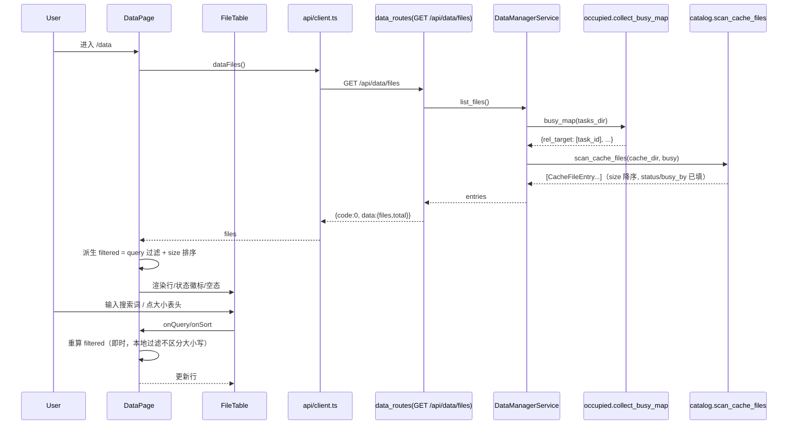
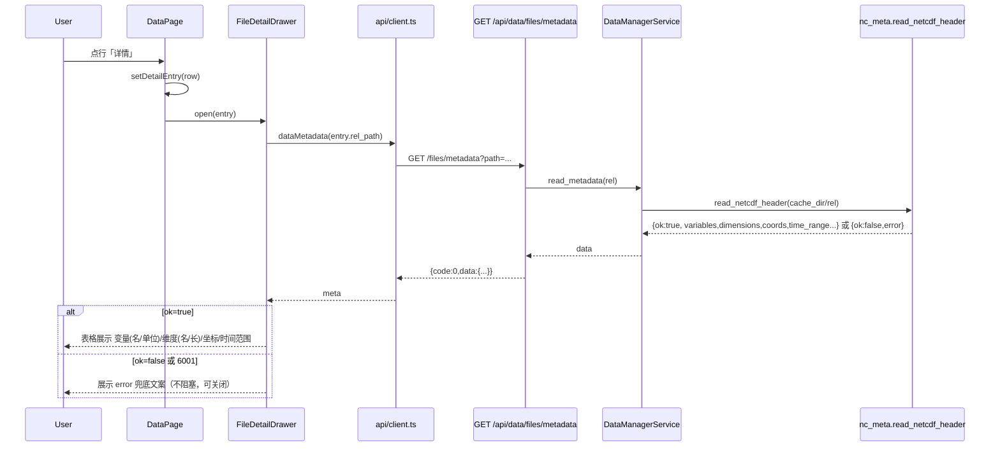
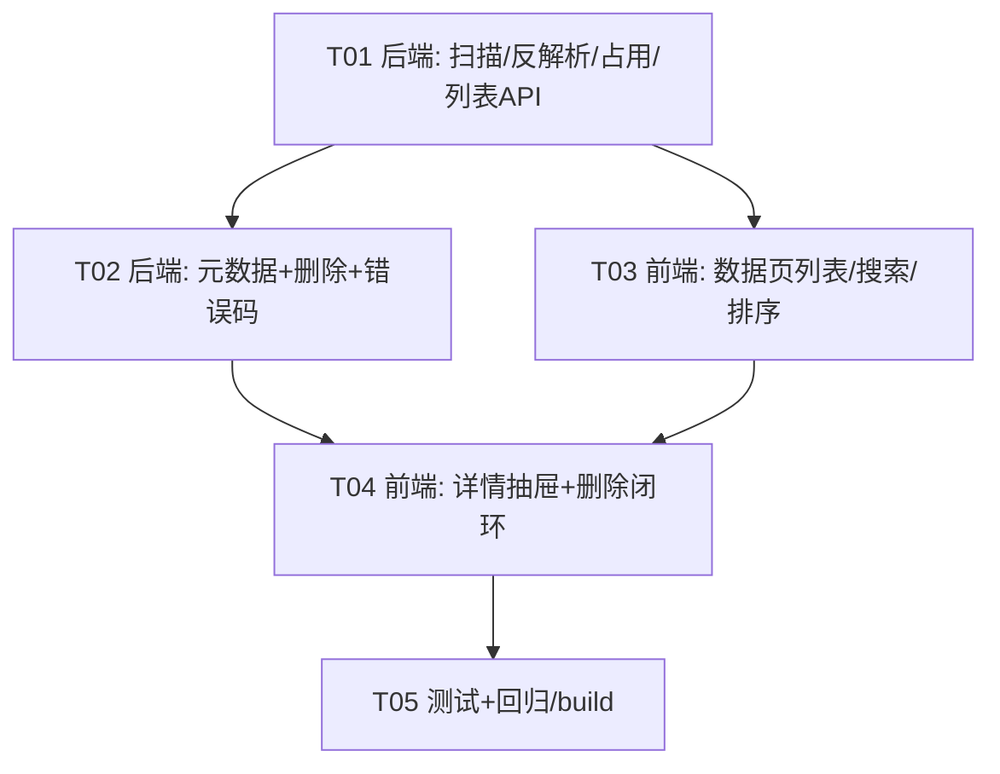

# 数据管理功能 系统设计 + 任务分解（design-data-manager）

- 作者：高见远（架构）
- 版本：v1.0
- 关联：`design-final.md`（总架构）、`design-speedup-download.md`（下载加速/缓存路径约定）
- 范围：**只读本地缓存 NetCDF 列表 + 元数据详情 + 安全删除（占用保护）**，独立于下载任务链路。

---

## Part A 系统设计

### 1. 实现方案与框架选型

#### 1.1 需求难点分析

| 难点 | 对策 |
|---|---|
| 递归扫描缓存根下深层 `.nc`（可能数千~数万文件） | `Path.rglob("*.nc")` 一次遍历 + `os.stat` 取大小/mtime；不做磁盘占用统计（用户已排除大图表） |
| 由相对路径反解析出 数据集/变量/频率/时间块 | 统一规则：`dataset/variable/freq/年份/(月份)/(日).nc`，freq 恒为 `hourly`/`monthly`，其后为数字段；反解析失败**不阻断列表**，降级展示 |
| 判定哪些文件正被下载任务占用（并发删除保护） | 任务状态**持久化于磁盘** `data/tasks/{task_id}/task.json`（无内存全集 dict，orchestrator 仅持 `_cancel_events`）。以 `running`/`pending` 任务 `params["blocks"][].rel_target` 构造占用集合（相对路径→任务ID）。删除前**现场重查占用** + Windows `PermissionError/OSError` 兜底转明确错误码，杜绝 500 裸奔 |
| 读取 NetCDF 头部元数据（不加载数据数组） | `netCDF4.Dataset(path, "r")` 只读头：变量/单位/维度/坐标属性 + time 坐标的首尾时间（`num2date`）。仅 time 变量做小数组切片，绝不整体 load 数据数组。**任何异常 → `{ok:false, error}` 兜底，不阻塞 UI**，无需新增依赖 |
| 单删/批删 + 错误码语义 | 后端统一批处理函数，路由区分：单删失败直接 `ApiError`（业务码 6001/6002/6003，沿用既有「HTTP 200 + body.code」契约）；批删允许部分成功返回逐文件结果 |
| 前端新页面 | Vite+React+TS+MUI5：新增 `DataPage` + 展示组件；沿用 `TasksPage` 表格模式；详情用右侧 `Drawer`，删除用 `Dialog` 二次确认，提示用 `Snackbar`；MUI 依赖已存在，**零新前端依赖** |

#### 1.2 架构模式与模块划分（MVC / 分层）

沿用现有「API 路由层 → service/领域层 → 基础设施」分层；数据管理**新增一个独立 service 领域包**，不侵入 orchestrator/下载链路：

```
FastAPI main.py
  └─ api/data_routes.py        路由层：仅做参数解析/ApiResponse 封装（controller）
       └─ data_manager/service.py   DataManagerService：编排扫描/占用/元数据/删除（facade）
            ├─ data_manager/catalog.py   纯函数：rel 路径反解析、human_size、扫描建 DTO
            ├─ data_manager/occupied.py  纯函数：读 tasks_dir 收集 running/pending 的 rel_target 占用集合
            └─ data_manager/nc_meta.py    纯函数：netCDF4 头部元数据读取（永不抛异常）
```

关键点：**占用判断直接读磁盘任务 JSON**（与 orchestrator 的持久化存储一致、不依赖内存），因此即使 worker 在独立进程写文件、重启后依然有效。任务状态机/续传/`prepare_blocks` 语义完全不动。

#### 1.3 框架与依赖选型结论

- 后端：FastAPI + pydantic（既有）；NetCDF 头读取用 **netCDF4 1.7.4（已装）**，不引入 xarray 开销（xarray 也已装，仅作异常后备说明，默认不 import）。无新增 pip 依赖。
- 前端：React18 + MUI5 + TS（既有）；图标复用 `@mui/icons-material`；axios 复用既有 client。无新增 npm 依赖。
- 测试：pytest（后端，回归现有 203 全绿）+ `npm run build`（前端类型与构建校验）。

---

### 2. 文件列表（相对项目根）

#### 后端（backend/era5tool）

| 路径 | 动作 | 说明 |
|---|---|---|
| `data_manager/__init__.py` | 新建 | 空包，可 re-export |
| `data_manager/catalog.py` | 新建 | `parse_rel_path / human_size / scan_cache_files`（纯逻辑，易测） |
| `data_manager/occupied.py` | 新建 | `collect_busy_map(tasks_dir)`：读取占用集合（running/pending 任务 blocks 的 rel_target） |
| `data_manager/nc_meta.py` | 新建 | `read_netcdf_header(abs_path)`：netCDF4 头读取，永不抛异常 |
| `data_manager/service.py` | 新建 | `DataManagerService`：`list_files / read_metadata / delete_paths / _resolve` |
| `api/data_routes.py` | 新建 | `/api/data/files`、`/api/data/files/metadata`、`DELETE /api/data/files` |
| `main.py` | 修改 | `app.include_router(data_routes.router)` |
| `config/schema.py` | 修改 | 追加数据管理错误码常量（6001/6002/6003），纯增量 |

#### 后端测试（backend/tests）

| 路径 | 动作 | 说明 |
|---|---|---|
| `test_data_catalog.py` | 新建 | 反解析/大小格式化/扫描/降级 |
| `test_data_service.py` | 新建 | 占用判定、删除保护、路径穿越、OSError 兜底（monkeypatch） |
| `test_data_nc_meta.py` | 新建 | 生成真实 netCDF4 样例读元数据；损坏文件兜底 |
| `test_data_api.py` | 新建 | 路由端到端：列表/元数据/单删/批删/错误码/占用 409 语义 |

#### 前端（web/src）

| 路径 | 动作 | 说明 |
|---|---|---|
| `types.ts` | 修改 | `CacheFile / FileMetaData / DeleteResult / BatchDeleteResponse` 等 |
| `api/client.ts` | 修改 | `dataFiles / dataMetadata / dataDeleteFile / dataDeleteFiles` |
| `utils/format.ts` | 新建 | `formatBytes / freqLabel / isBusy` 等展示工具 |
| `pages/DataPage.tsx` | 新建 | 数据页容器：状态、过滤、排序、勾选、弹层编排、Snackbar |
| `components/data/FileTable.tsx` | 新建 | 扁平表格（勾选/列/可排序大小表头/空态） |
| `components/data/FileStatusChip.tsx` | 新建 | 就绪/下载中占用 徽标 + Tooltip（显示占用任务） |
| `components/data/FileDetailDrawer.tsx` | 新建 | 右侧抽屉：元数据详情 + 读取失败兜底 |
| `components/data/DeleteFileDialog.tsx` | 新建 | 删除确认对话框（单删/批删两种模式） |
| `App.tsx` | 修改 | 注册 `/data` 路由 |
| `components/common/Layout.tsx` | 修改 | 侧边导航新增「数据」入口 |

---

### 3. 数据结构与接口

#### 3.1 后端 DTO 与函数

**CacheFileEntry（文件列表行，响应字段）**

```python
class CacheFileEntry(BaseModel):
    rel_path: str            # 相对缓存根的 POSIX 路径，如 reanalysis-era5-single-levels/2m_temperature/hourly/2020/01/05.nc
    dataset: str             # 反解析段0；失败="未知"
    variable: str            # 反解析段1；失败=文件名 stem
    freq: str                # "hourly"|"monthly"（UI 转文案）；失败=""
    period: str              # 时间块展示文本："2020" | "2020-01" | "2020-01-05"；失败=""
    size: int                # 字节
    human_size: str          # "123.4 MB"
    status: str              # "ready" | "busy"（busy=被 running/pending 下载任务引用）
    busy_by: List[str]       # 占用该文件的任务 ID 列表（busy 时非空，供前端 Tooltip）
    mtime: str               # "YYYY-MM-DD HH:MM:SS"（本地时区，展示用）
    parsed: bool             # 反解析是否成功
```

**ParsedParts（内部，catalog.py）**

```python
@dataclass
class ParsedParts:
    dataset: str
    variable: str
    freq: str                # hourly | monthly
    year: int
    month: Optional[int] = None
    day: Optional[int] = None
    period: str              # 同 CacheFileEntry.period
```

**catalog.py 纯函数**

```python
def parse_rel_path(rel: str) -> Optional[ParsedParts]:
    """rel 示例：reanalysis-era5-single-levels/2m_temperature/hourly/2020/01/05.nc
    规则：段= [dataset, variable, freq, year, (mm), (dd)]；freq 恒为 hourly/monthly，
    freq 之后为 1~3 个纯数字段（year / year+mm / year+mm+dd），其余形态返回 None。"""

def human_size(num_bytes: int) -> str:
    """B/KB/MB/GB/TB，>=1KB 保留 1 位小数（1000 进制换算，展示用）。"""

def scan_cache_files(cache_dir: Path,
                     busy: Mapping[str, Sequence[str]]) -> List[CacheFileEntry]:
    """rglob("*.nc") 建行；size 降序（默认）；目录不存在返回 []。"""
```

**occupied.py 纯函数**

```python
def collect_busy_map(tasks_dir: Path) -> Dict[str, List[str]]:
    """遍历 data/tasks/*/task.json，仅取 status ∈ {running, pending} 的任务，
    收集 params["blocks"][].rel_target → 任务 ID 列表（Key=POSIX 相对路径）。
    单文件损坏/JSON 解析失败跳过，绝不抛异常。"""
```

**nc_meta.py 纯函数**

```python
def read_netcdf_header(abs_path: Path) -> Dict[str, Any]:
    """成功: {ok:True, format, dimensions:[{name,length,is_unlimited}],
              variables:[{name,long_name,units,dims,shape,is_coord}],
              coords:[...], time_range:{start,end,units,calendar}|None,
              global_attrs:{...}}
    任何异常: {ok:False, error:"无法读取元数据：<原因>"}（绝不 raise）。
    说明：只读头；time 坐标仅取 var[:] 首尾做 num2date（单文件点数小，安全）。
    """
```

**service.py**

```python
class DataManagerService:
    def __init__(self, settings: Settings) -> None:
        # 自持 TaskStore 语义：直接使用 settings.tasks_dir 读 task.json（与下载链路存储一致）
    def busy_map(self) -> Dict[str, List[str]]: ...          # 委托 occupied.collect_busy_map
    def list_files(self) -> List[CacheFileEntry]: ...        # scan_cache_files(cache_dir, busy_map())
    def read_metadata(self, rel: str) -> Dict[str, Any]: ... # 校验→read_netcdf_header；不存在→ApiError(6001)
    def delete_paths(self, rels: List[str]) -> List[Dict[str, Any]]:
        # 返回每项 {path, status: ok|busy|not_found|failed, error?, released_bytes}
        # 单文件流程: 路径校验→存在性→占用重查→os.unlink→PermissionError/OSError 兜底
    def _resolve(self, rel: str) -> Path: ...
        # 防穿越：拒绝绝对路径/`..`；仅允许 cache_dir 内且后缀 .nc；非法→ApiError(ERR_PARAM,1001)
```

#### 3.2 后端路由

沿用既有「统一响应 + ApiError → HTTP 200 + body {code,data,message}」契约；controller 只做参数与封装。

| 方法 | 路径 | 参数 | 成功 data | 失败（ApiError 业务码） |
|---|---|---|---|---|
| GET | `/api/data/files` | 无 | `{files:[CacheFileEntry...], total:int}` | — |
| GET | `/api/data/files/metadata` | `path=<rel>` | `read_netcdf_header` 返回的 dict（含 ok=false 兜底） | 6001 文件不存在 |
| DELETE | `/api/data/files` | `path=<rel>`（单删）**或** `paths=<rel>&paths=<rel>`（批删） | 单删：`{path,status:"ok",released_bytes}`；批删：`{requested,deleted,busy,failed,released_bytes,results:[...]}` | 单删：6001 不存在 / 6002 占用 / 6003 删除失败；参数缺失或同时传两者→1001 |

**错误码常量（config/schema.py 追加）**

```python
ERR_FILE_NOT_FOUND = 6001   # 语义≈404：文件不存在或已被外部移除
ERR_FILE_BUSY      = 6002   # 语义≈409：文件被 running/pending 下载任务占用，禁止删除
ERR_FILE_DELETE_FAILED = 6003  # 语义≈500：无权限/Windows 文件被占用/其他 IO 失败
```

**删除的占用保护要点（后端强制）**
1. 入参即校验（`.nc` + 无穿越）。
2. 删除前 **现场重查 busy_map**：命中 → 该文件 busy（单删抛 6002；批删记入 results）。
3. Windows 下正在被 worker `open(target,"wb")` 写、但瞬时未进 busy_map 的竞态 → `os.unlink` 抛 `PermissionError`/`OSError`（常见 WinError 32/5）。捕获后**再次查 busy**，命中转 6002，否则转 6003 且 message 给出「无权限或文件被其他程序占用」，绝不 500 裸奔、绝不误报成功。
4. `FileNotFoundError`（列表后外部已删）→ 6001「文件不存在或已被外部移除」，由前端提示并刷新。

#### 3.3 前端数据结构

```ts
// types.ts 追加
export type CacheFileStatus = "ready" | "busy";
export interface CacheFile {
  rel_path: string; dataset: string; variable: string; freq: string;
  period: string; size: number; human_size: string;
  status: CacheFileStatus; busy_by: string[]; mtime: string; parsed: boolean;
}
export interface NetcdfDimMeta { name: string; length: number; is_unlimited: boolean }
export interface NetcdfVarMeta {
  name: string; long_name?: string; units?: string;
  dims: string[]; shape: number[]; is_coord: boolean;
}
export interface FileMetaData {
  ok: boolean; error?: string; format?: string;
  variables?: NetcdfVarMeta[]; dimensions?: NetcdfDimMeta[];
  coords?: string[]; time_range?: { start: string; end: string; units: string; calendar: string } | null;
  global_attrs?: Record<string, unknown>;
}
export type DeleteStatus = "ok" | "busy" | "not_found" | "failed";
export interface DeleteFileResult { path: string; status: DeleteStatus; error?: string; released_bytes: number }
export interface BatchDeleteResponse {
  requested: number; deleted: number; busy: number; failed: number;
  released_bytes: number; results: DeleteFileResult[];
}
```

**前端组件职责与数据流**

- `DataPage`（容器）：持有 `files/loading/error/query/sortDir/selected/detailEntry/confirm(单|批)/snackbar`；派生 `filtered = useMemo(filter + sort)`；`refresh()` 拉 `/data/files`；详情与删除回调在此实现，传给子组件。
- `FileTable`（展示）：受控表格，props `rows/loading/sortDir/selected/onSort/onToggle/onToggleAll/onDetail/onDelete/emptyKind`；大小表头可点击切换 asc/desc（默认 desc）；busy 行勾选与删除禁用；空态（无缓存/搜索无结果）在此渲染。
- `FileStatusChip`：`ready`→success「就绪」；`busy`→warning「下载中占用」，Tooltip 显示占用任务 ID。
- `FileDetailDrawer`：打开时 `api.dataMetadata(rel_path)` 拉取；loading/成功表/失败兜底三态。
- `DeleteFileDialog`：`mode="single"`（相对路径+大小+不可撤销）或 `mode="batch"`（将删除 N 个文件、释放约 XX）；提交期间禁用；确认后回调 DataPage 调删除 API。
- `api/client.ts` 新增方法签名见 4.1/4.2 时序（axios）。

---

### 4. 程序调用流程（时序图）

#### 4.1 列表加载 → 渲染 → 搜索/排序



#### 4.2 点详情 → 元数据读取 → 渲染（含失败兜底）



#### 4.3 删除链路（单删 / 批删）与并发占用 409 兜底

```mermaid
sequenceDiagram
    participant U as User
    participant DP as DataPage
    participant DLG as DeleteFileDialog
    participant API as api/client.ts
    participant RT as DELETE /api/data/files
    participant SVC as DataManagerService

    U->>DP: 点删除(行) 或 勾选后点批量删除
    DP->>DLG: open(single|batch, entries)
    DLG-->>U: 二次确认（单: rel路径+大小 / 批: N 个+释放约 XX）
    U->>DLG: 确认
    DLG->>DP: onConfirm()
    DP->>API: dataDeleteFile(rel) 或 dataDeleteFiles(paths)
    API->>RT: DELETE /files?path=... 或 ?paths=a&paths=b
    RT->>SVC: delete_paths(rels)
    SVC->>SVC: 现场重查 busy_map
    alt 目标 busy
        SVC-->>RT: {status:busy,...}
        alt 单删
            RT-->>API: ApiError 6002「被任务 X 使用中，禁止删除」
            API-->>DP: throw Error(6002 message)
            DP->>DP: Snackbar error + refresh()（行恢复 ready/busy 最新）
        else 批删
            RT-->>API: {code:0, results:[{path,busy}...]}
            API-->>DP: BatchDeleteResponse
            DP->>DP: Snackbar「删除 X 个，N 个被占用」
        end
    else 可删
        SVC->>SVC: os.unlink; 捕获 PermissionError/OSError→重查 busy→busy/failed
        SVC-->>RT: {status:ok|failed, released_bytes}
        RT-->>API: 响应（单删失败→ApiError 6001/6002/6003）
        API-->>DP: 结果
        DP->>DP: 成功 Snackbar + 清理勾选 + refresh()
    end
    DP-->>U: 列表刷新后呈现最新状态
```

---

### 5. Anything UNCLEAR / 假设

1. **缓存文件量级 / 分页**：当前设计列表全量返回、前端本地搜索/排序。若用户缓存可达到数十万级（如多任务 day 粒度多年），单次 JSON 会较大；本工具面向本地桌面、文件数通常 ≤ 几万，**假设可接受**，如后续吃紧再加服务端 `search/paging`（P2，不影响本次闭环）。
2. **删除成功任务缓存是否联动任务**：默认「只删缓存文件、任务记录与 result.files 保留」；用户后续再用相关任务续传/出图会按缺文件重建。假设不需要反写任务状态。
3. 元数据「变量较多时前端只滚动展示、不做分页」；单文件变量数极少（ERA5 单变量任务），假设无需裁剪。

> 若以上假设需产品/用户拍板，请转达；否则按上表落地。

---

## Part B 任务分解

### 6. 依赖包列表（应无新增）

后端（backend venv 已装，无需新增）：
```
- netCDF4 1.7.4    # NetCDF 头部元数据读取（头文件不加载数据数组）
- fastapi / pydantic / pytest   # 既有
```
前端（package.json 既有，无需新增）：
```
- @mui/material@^5.15.11        # Table/Drawer/Dialog/Snackbar/Tooltip/Chip
- @mui/icons-material@^5.15.11  # 详情/删除/刷新/存储 图标
- axios@^1.6.8                  # api client（复用）
- react-router-dom@^6.22.3      # /data 路由（复用）
```
> 说明：xarray 2026.7.0 虽已安装但不依赖；netCDF4 打开普通 NetCDF3/NetCDF4 均原生支持。若遇到打开即崩（写中文件/HDF 错误），nc_meta 已统一 catch 返回 `ok:false` 兜底，无需备选引擎。

### 7. 任务列表（按依赖序；P0 全链路可交付，P1 批删含于 T04）

#### T01 — 后端：扫描 + 反解析 + 占用集合 + 列表 API
- **源文件**：`backend/era5tool/data_manager/__init__.py`（新建）、`backend/era5tool/data_manager/catalog.py`（新建）、`backend/era5tool/data_manager/occupied.py`（新建）、`backend/era5tool/data_manager/service.py`（新建，先实现 `busy_map/list_files`）、`backend/era5tool/api/data_routes.py`（新建，先实现 `GET /api/data/files`）、`backend/era5tool/main.py`（修改注册 router）、`backend/era5tool/config/schema.py`（修改，追加 6001/6002/6003 常量）
- **依赖**：无
- **优先级**：P0
- **验收点**：
  - 在临时 cache 建样例 `{dataset}/{var}/monthly/2020.nc`、`.../hourly/2020/01.nc`、`.../hourly/2020/01/05.nc`，`GET /api/data/files` 返回 3 行且 period 分别为 `2020/2020-01/2020-01-05`，size 降序、human_size 正确；
  - 伪造一个 status=running 的 task.json（blocks 含上述 rel_target），对应行 `status=busy` 且 `busy_by` 含该任务 ID；
  - 缓存目录为空返回 `{files:[], total:0}`，无异常；
  - 反解析失败文件（如 `cache/foo.nc`）不阻断，字段降级、`parsed=false`。

#### T02 — 后端：元数据读取 + 删除（单删/批删 + 占用拦截 + 错误码 + Windows 兜底）
- **源文件**：`backend/era5tool/data_manager/nc_meta.py`（新建）、`backend/era5tool/data_manager/service.py`（修改：`read_metadata/_resolve/delete_paths`）、`backend/era5tool/api/data_routes.py`（修改：`GET /files/metadata`、`DELETE /files`）、`backend/era5tool/config/schema.py`（若 T01 未加码则补加）
- **依赖**：T01
- **优先级**：P0
- **验收点**：
  - 对生成的 netCDF4 样例读元数据返回 变量(名称/单位/维度/形状/is_coord)/维度(名/长)/坐标/time_range；写坏字节的文件返回 `{ok:false,error}`，不抛 500；
  - 单删成功 code=0、文件消失、返回 `released_bytes`；
  - 单删被占用任务引用文件 → code 6002；删除不存在/外部已移除文件 → code 6001；
  - monkeypatch `os.unlink` 抛 `PermissionError`：占用的→6002，未占用的→6003，message 中文明确；
  - 批删（1 个可删 + 1 个 busy + 1 个 not_found）→ code=0，`results` 逐文件 status 正确，`deleted/busy/failed/released_bytes` 汇总正确；
  - 路径穿越（`../`、绝对路径、非 .nc）→ code 1001。

#### T03 — 前端：数据管理页（列表/搜索/排序/状态徽标/空态/刷新/路由）
- **源文件**：`web/src/types.ts`（修改，加 `CacheFile` 等基础类型）、`web/src/api/client.ts`（修改，加 `dataFiles`）、`web/src/utils/format.ts`（新建）、`web/src/pages/DataPage.tsx`（新建）、`web/src/components/data/FileTable.tsx`（新建）、`web/src/components/data/FileStatusChip.tsx`（新建）、`web/src/App.tsx`（修改）、`web/src/components/common/Layout.tsx`（修改）
- **依赖**：T01（列表接口）
- **优先级**：P0
- **验收点**：
  - 侧边栏出现「数据」，点击进入 `/data`；页首标题「数据」+ 文件数 Chip + 刷新按钮；
  - 表格列=勾选/数据集/变量/频率/时间块/大小/状态/操作；大小表头点击切升/降序，**默认降序**；
  - 搜索框即时过滤（数据集/变量/rel_path 包含、不区分大小写），清空恢复；空缓存页空态、搜索无结果空态；
  - 就绪/下载中占用徽标与 Tooltip；busy 行勾选与删除按钮禁用（hover 提示）；
  - `cd web && npm run build` 通过。

#### T04 — 前端：详情抽屉 + 删除闭环（单删/批删 + 确认 + Snackbar + 错误兜底）
- **源文件**：`web/src/components/data/FileDetailDrawer.tsx`（新建）、`web/src/components/data/DeleteFileDialog.tsx`（新建）、`web/src/pages/DataPage.tsx`（修改，接抽屉/对话框/删除回调/refresh/清理勾选）、`web/src/api/client.ts`（修改，加 `dataMetadata/dataDeleteFile/dataDeleteFiles`）、`web/src/types.ts`（修改，加 `FileMetaData/DeleteResult/BatchDeleteResponse`）
- **依赖**：T02、T03
- **优先级**：P0（单删）；P1（批删）—— 同一任务内交付
- **验收点**：
  - 点行/「详情」开右侧抽屉：变量列表(名/单位)、维度(名/长)、坐标、时间范围；读失败/文件消失显示兜底文案，可关闭，不整页崩溃；
  - 单删：确认对话框展示相对路径+易读大小与「不可撤销」；成功后 Snackbar「已删除，释放 XX」并刷新；失败（6001/6002/6003）Snackbar 显示后端中文 message；
  - 批删：勾选可删行（busy 禁用勾选）后按钮可用，确认框写「将删除 N 个文件，释放约 XX」；部分失败（含并发 busy）Snackbar 汇总「删除 X 个成功，N 个被占用/失败」，随后刷新；
  - 前端拦截失效场景：删除 busy 文件被后端 6002 拒绝时，Snackbar 明确提示并刷新（不误报成功）。

#### T05 — 测试与回归（后端 pytest + 前端 build）
- **源文件**：`backend/tests/test_data_catalog.py`（新建）、`backend/tests/test_data_service.py`（新建）、`backend/tests/test_data_nc_meta.py`（新建）、`backend/tests/test_data_api.py`（新建）
- **依赖**：T02、T04（全部功能就绪）
- **优先级**：P0
- **验收点**：
  - `cd backend && python -m pytest tests -q` 全绿：既有 203 用例不回归 + 新增用例覆盖 反解析/扫描/占用/删除保护/错误码/元数据兜底/API e2e；
  - `cd web && npm run build` 通过；
  - 无新增依赖；编码风格符合既有约定。

### 8. 共享知识（跨文件约定）

- **相对路径反解析规则**：`{dataset}/{variable}/{freq}/{year}.nc` 或 `.../{year}/{mm}.nc` 或 `.../{year}/{mm}/{dd}.nc`；freq 仅 `hourly|monthly`；freq 后为 1~3 个纯数字段。period 文本 = 数字段按 `YYYY[-MM[-DD]]` 组装。
- **human_size**：`B/KB/MB/GB/TB`；`>=1KB` 显示 1 位小数（1000 进制）。前后端可各自实现一致展示；后端返回 DTO 字段，前端仅在对勾选求和时用 `formatBytes`。
- **status 语义**：`busy` = 该 rel_path 被任一 **running/pending** 下载任务 `params["blocks"][].rel_target` 引用（无论该块是否已写盘，保守保护）；否则 `ready`。任务其余状态（success/failed/paused）不产生占用。
- **错误码契约**：沿用 HTTP 200 + `{code,data,message}`；数据管理错误码 `6001=文件不存在/外部移除(≈404)`、`6002=被下载任务占用禁止删除(≈409)`、`6003=无权限或 IO 删除失败(≈500)`；前端 client 拦截器对 code!=0 throw Error(message)，单删走 catch 提示，批删解析 body.data.results。
- **前端路由/文案**：path `/data`，侧边栏文案「数据」；频率显示映射 `hourly→逐小时`、`monthly→月均`（raw 仍保留于 DTO）。
- **安全**：删除/元数据只接受 `.nc` 相对路径，禁止绝对路径/`..` 穿越；仅作用于 `settings.cache_dir` 下。
- **代码风格**：Python 文件头 `# -*- coding: utf-8 -*-` + `from __future__ import annotations`；中文注释；新增包不动 orchestrator/cds 下载语义（占用仅轻量读 task.json）。前端延续现有 TS + MUI 组合方式。
- **既有测试不得破坏**：后端 pytest 全量（现 203）须保持绿；新增测试自行隔离数据目录（沿用 `ERA5_CONFIG_DIR/ERA5_DATA_DIR` 或 `Settings.load(config_dir=...,data_dir=...)` 临时目录模式）。

### 9. 任务依赖图



> 说明：T02 与 T03 可并行（均只依赖 T01）；T04 依赖 T02+T03；T05 收尾。总计 5 个任务，符合硬上限。
