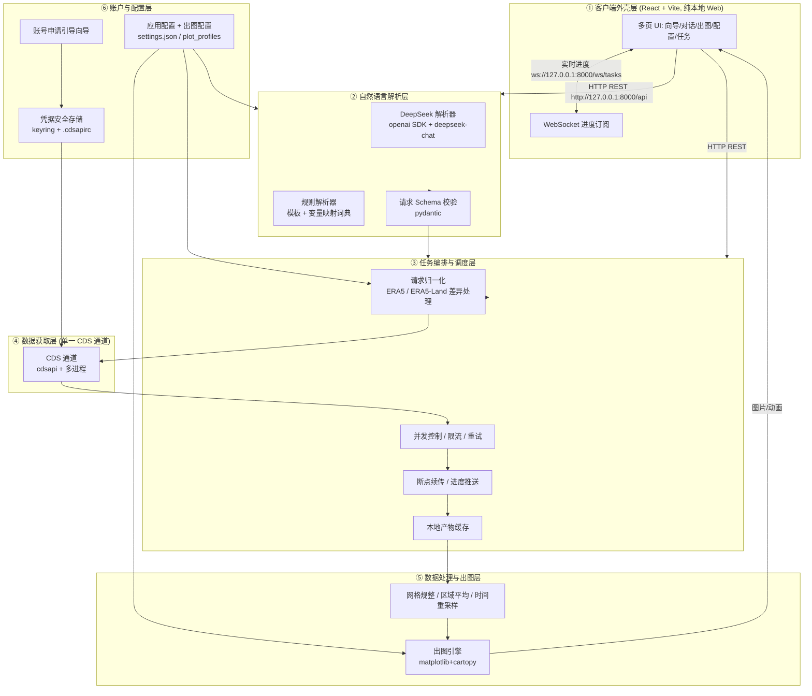
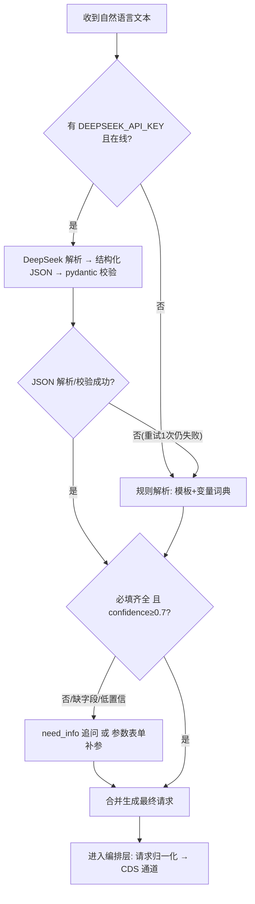
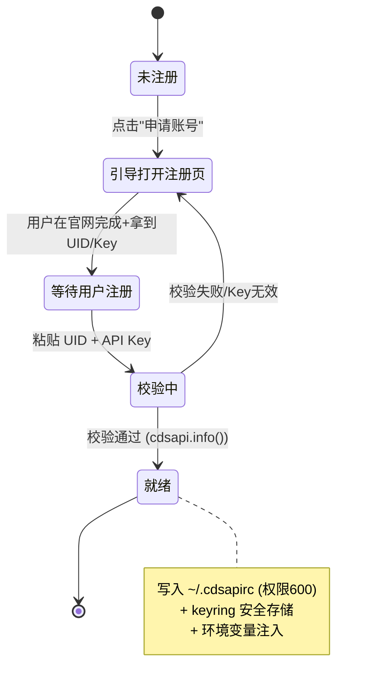
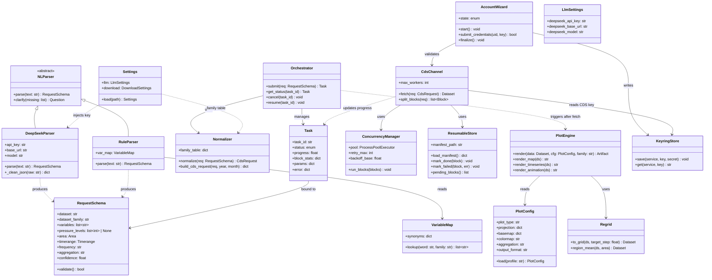
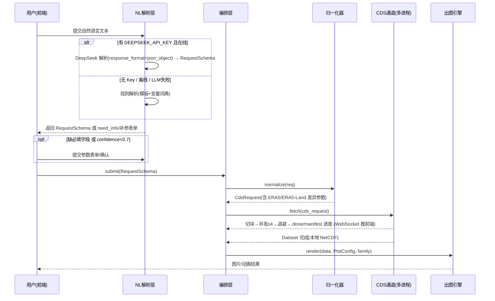
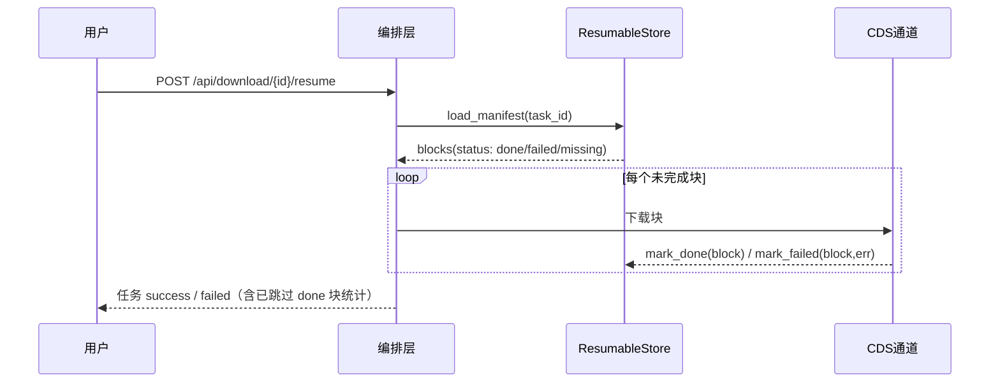
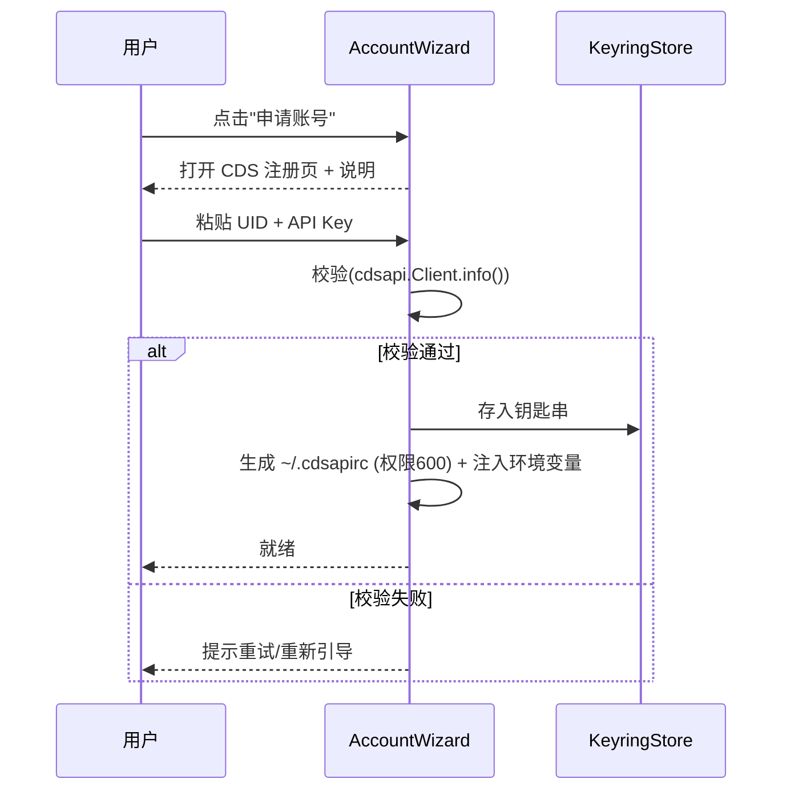

# ERA5 自然语言下载 + 出图工具 · 最终版设计（v2 收敛版）

> 角色：架构师「高见远」 · 阶段：最终设计收敛（仅设计，不写业务代码；允许接口/JSON/prompt 模板/伪代码级设计）
> 基线：在 `docs/system_design.md`（v1 架构）与 `docs/implementation-plan.md`（v1 落地方法）基础上收敛
> 权威性：**本文件为 v2 唯一权威施工依据**。与 v1 冲突处以本文件为准；工程师照此施工。
> 适用：后端 FastAPI + 前端 Vite/React + 单 CDS 通道 + DeepSeek NL 层 + 纯本地 Web 交付。

---

## 0. 决策基线（v2，用户拍板，不可推翻）

| # | 决策 | 内容 | 对本设计的影响 |
|---|---|---|---|
| D1 | **LLM = DeepSeek** | NL 解析层统一走 DeepSeek OpenAI 兼容接口：`base_url=https://api.deepseek.com`，模型 `deepseek-chat`；配置项 `DEEPSEEK_API_KEY` | NL 层只用 `openai` SDK；移除 dashscope/zhipuai；prompt 适配 `response_format={"type":"json_object"}`（需显式含 "json" 字样） |
| D2 | **交付形态 = 纯本地 Web** | 不做 Tauri/Electron 桌面壳；前端 Vite dev server + 后端 FastAPI 同机运行；前端经 `http://127.0.0.1:8000` 调 REST/WS | 删除 `web/src-tauri/`；设计 CORS 白名单与 Vite proxy；Phase 6 不再打包桌面 |
| D3 | **不启用 GCS 通道** | 删除 arco-era5/GCS/zarr/gcsfs/dask 云通道的一切设计（依赖、通道路由、重采样、覆盖矩阵、缓存策略中的云部分） | 系统变**单一 CDS 通道**；架构图/依赖/目录/路由全部简化；保留 xarray（读本地 NetCDF 出图用） |
| D4 | **必须支持 ERA5-Land** | CDS 数据集 `reanalysis-era5-land`（hourly）与 `reanalysis-era5-land-monthly-means` 纳入主支持；variable_map 补 ERA5-Land 高频词条 | 新增 dataset family 归一化；ERA5-Land 无气压层、时间维度 hour、0.1° 网格，下载/出图模板需区分处理 |

**v1 → v2 变更摘要（供快速对照）**
- 架构：双通道 → 单 CDS 通道（删除 GCS 组件、arco 覆盖矩阵、GCS 路由分支、高斯网格重采样、云缓存）。
- NL：多 LLM 可插拔 → 仅 DeepSeek（openai SDK + deepseek-chat），规则兜底保留。
- 交付：Tauri 桌面壳 → 纯本地 Web（Vite proxy + FastAPI CORS）。
- 数据：新增 ERA5-Land（hourly + monthly-means）主支持，变量词典扩展至约 35 个标准变量。
- 验证：原「GCS 覆盖探测」实验废弃 → 重设计 5 个可离线 mock 的先行实验（见 §10）。

---

## 1. 总体架构（终版）

### 1.1 架构总览

采纳「**单一 CDS 数据通道 + 自然语言解析层 + Web 外壳 + 出图面板 + 账号向导**」的分层架构：

- **内核与外壳解耦**：所有数据能力（下载/解析/出图/账号）封装为本地 FastAPI 服务（`127.0.0.1:8000`），前端 Vite dev server（`127.0.0.1:5173`）只负责交互与展示，二者同机、通过 REST/WS 通信。
- **单一 CDS 通道**：所有下载请求统一走 Copernicus CDS API（`cdsapi` + 多进程并发），不再有任何云通道分支。
- **NL 双模**：有 `DEEPSEEK_API_KEY` 走 DeepSeek 大模型解析；无 Key/离线走「规则模板 + 中英变量映射词典 + 参数表单」兜底，保证功能不塌陷。
- **出图配置外置**：变量映射、投影/底图、配色、聚合、输出格式均以配置文件 + 面板暴露，优先级可热加载。

### 1.2 架构图（Mermaid，v2：无 GCS，单 CDS 通道）



### 1.3 各层职责（终版）

| 层 | 职责 | 关键能力 |
|---|---|---|
| ① 外壳层 | 用户交互、请求提交、进度/结果展示 | 傻瓜式向导、对话补参、出图配置面板、账号引导页、任务列表 |
| ② NL 解析层 | 自然语言 → 结构化下载请求 | DeepSeek 多轮澄清、规则兜底、变量中文→英文映射、Schema 校验、confidence 确认 |
| ③ 编排层 | 请求归一化、任务落库、并发/限流、断点续传、进度推送 | 数据集家族差异归一化、任务状态机、失败重试、限速保护 |
| ④ 获取层 | 实际拉取数据（唯一 CDS 通道） | CDS 多进程并行 + 指数退避 + 断点续传 |
| ⑤ 处理/出图层 | 数据规整与可视化 | 网格规整（ERA5-Land 0.1° / ERA5 0.25°）、区域平均、时空聚合、三类图 |
| ⑥ 账户/配置层 | 凭据与配置治理 | 半自动账号引导、Key 安全存储、出图配置热加载、DeepSeek Key 管理 |

### 1.4 数据流（一句话版）

```
用户一句话 → NL(DeepSeek/规则) → RequestSchema → 编排层归一化(区分 ERA5/ERA5-Land)
→ CDS 通道(切块+并发+退避+断点续传) → 本地 NetCDF 缓存 → 出图引擎(空间/时序/动画) → 前端展示
```

---

## 2. 技术选型终版

### 2.1 前端选型（v2：去掉 Tauri/Electron）

> 形态：**纯本地 Web**。Vite dev server（127.0.0.1:5173）+ 后端 FastAPI（127.0.0.1:8000）同机运行。

| 技术 | 用途 | 说明 |
|---|---|---|
| React 18 + TypeScript | UI 框架 + 类型安全 | 生态成熟、TS 减少前后端接口错位 |
| Vite | 构建 / 本地开发服务器 | 启动快、HMR 顺滑；负责 `/api` 与 `/ws` 代理 |
| Tailwind CSS | 原子化样式 | 快速统一视觉 |
| MUI (Material UI) | 组件库 | 表单、对话框、步骤条、向导组件开箱即用 |
| Zustand | 轻量状态管理 | 多面板共享状态 |
| React Router | 多页路由 | 向导/对话/出图/配置/任务多视图 |
| Axios | HTTP 客户端 | 调后端 REST |
| WebSocket（原生） | 实时进度/日志 | 任务进度条、日志流式推送 |

**交互契约**：前端不直接调用 CDS，一律经后端 REST/WS；响应统一 `{code, data, message}`。
**移除**：`@tauri-apps/api`、`web/src-tauri/`、桌面打包相关一切。

### 2.2 后端选型（v2：去掉 GCS 云依赖；NL 层 = DeepSeek）

| 分组 | 技术 | 用途 | 选型理由 |
|---|---|---|---|
| 语言/框架 | Python 3.11 + FastAPI | REST/WS 服务 | 原生异步、自动 OpenAPI、易与数据科学生态集成 |
| 并发模型 | asyncio + multiprocessing / subprocess | CDS 并行下载 | `cdsapi` 本质串行，必须多进程绕过；asyncio 管 IO 与调度 |
| 任务调度 | 内存任务表（初版）→ 可选 SQLite（进阶） | 任务状态/队列 | 初版单用户本地，内存表 + `data/tasks/*.json` 足够 |
| **CDS 通道** | `cdsapi` | 调 Copernicus CDS API | 官方客户端，支持 ERA5 与 ERA5-Land 全量 |
| **NL 层** | `openai`（OpenAI SDK 指向 DeepSeek） | DeepSeek 调用 | OpenAI 兼容接口，官方 SDK 即可，无需额外 SDK |
| **NL 兜底** | 规则模板 + `variable_map.json` | 离线解析 | 无 Key/离线时保证可下载 |
| 出图层 | `matplotlib` `cartopy` `pandas` `xarray` `netCDF4` | 空间/时序/动画 | 成熟、可控；xarray 读本地 NetCDF |
| 账号 | `keyring` `python-dotenv` | 凭据安全存储/读取 | 钥匙串/系统凭据，绝不入库 |
| 配置 | `pydantic` `pydantic-settings` | 配置加载与校验 | 类型安全、Schema 约束 |
| 存储 | 本地文件系统 + `settings.json` + `.cdsapirc` + `.env` | 缓存/配置 | 单用户本地无需外部 DB |
| 日志 | `structlog` / `logging` | 进度与审计日志 | 供 WebSocket 推送 |

**移除的依赖**：`gcsfs`、`zarr`、`dask`、`cfgrib`、`fsspec`、`dashscope`、`zhipuai`、`@tauri-apps/api`。
**保留的 xarray 定位**：仅用于读取本地 NetCDF 产物并做出图前处理（区域平均/重采样/聚合），不做任何云直读。

### 2.3 CORS 与前端 dev 代理（D2 落地）

**后端（FastAPI）CORS 配置**：

```python
from fastapi.middleware.cors import CORSMiddleware

app.add_middleware(
    CORSMiddleware,
    allow_origins=["http://127.0.0.1:5173", "http://localhost:5173"],
    allow_credentials=True,
    allow_methods=["*"],
    allow_headers=["*"],
)
```

**前端（Vite）dev 代理（`web/vite.config.ts`）**——生产推荐走代理，同源免 CORS：

```ts
export default defineConfig({
  server: {
    host: "127.0.0.1",
    port: 5173,
    proxy: {
      "/api": { target: "http://127.0.0.1:8000", changeOrigin: true },
      "/ws":  { target: "ws://127.0.0.1:8000", ws: true }
    }
  }
})
```

- 前端 API 基地址统一 `http://127.0.0.1:8000`（直连）或 `/api`（走代理，二选一，配置项 `VITE_API_BASE`）。
- WebSocket 地址 `ws://127.0.0.1:8000/ws/tasks`（直连）或 `ws://127.0.0.1:5173/ws/tasks`（代理）。

### 2.4 进程模型（终版）

```
┌──────────────┐   REST/WS    ┌─────────────────────────────────────┐
│ Vite dev     │ ───────────▶ │ FastAPI 主进程 (uvicorn, :8000)      │
│ server :5173 │              │  ├─ asyncio: REST 路由 / WS 广播      │
│ (React)      │ ◀─────────── │  ├─ 任务编排: 切块/状态机/进度        │
└──────────────┘              │  └─ ProcessPool/subprocess: CDS worker│
                              │       每个 worker 独立 cdsapi 客户端   │
                              └─────────────────────────────────────┘
```

- CDS 下载在**独立子进程**中执行（`subprocess.Popen` 首选，备选 `ProcessPoolExecutor`），隔离 GIL 与崩溃影响。
- 并发上限默认 `cds_max_workers=4`，可配置。

---

## 3. 逻辑条件终版

### 3.1 自然语言解析成立条件（判定表，终版）

| 条件 | 解析路径 | 说明 |
|---|---|---|
| 已配置 `DEEPSEEK_API_KEY` **且** 网络可达 | **DeepSeek 解析**：NL → JSON Schema → 多轮澄清 → 校验合并 | 体验最佳，支持模糊中文/英文 |
| 无 `DEEPSEEK_API_KEY` **或** 网络失败 | **规则兜底**：模板匹配 + 变量映射词典 → 必填项缺失则弹参数表单 | 离线可用，覆盖常见句式 |
| 规则兜底仍缺关键参数 | **参数表单**：用户手动选 数据集/变量/时空/聚合 | 绝不阻塞，保证可下载 |



### 3.2 DeepSeek LLM 解析设计（D1 落地，关键适配）

**配置项**（`config/deepseek.example.env` → 运行时读入 `settings.llm`）：

```
DEEPSEEK_API_KEY=sk-xxxxxxxxxxxxxxxx
DEEPSEEK_BASE_URL=https://api.deepseek.com
DEEPSEEK_MODEL=deepseek-chat
```

**调用封装（伪代码级）**：

```python
from openai import OpenAI

client = OpenAI(api_key=settings.llm.deepseek_api_key,
                base_url=settings.llm.deepseek_base_url)  # https://api.deepseek.com

resp = client.chat.completions.create(
    model=settings.llm.deepseek_model,        # deepseek-chat
    messages=[{"role": "system", "content": SYSTEM_PROMPT},
              {"role": "user",   "content": user_text}],
    response_format={"type": "json_object"},  # DeepSeek 支持 JSON 模式
    temperature=0.1,
    max_tokens=1024,
)
raw = resp.choices[0].message.content
```

**⚠️ DeepSeek JSON 模式适配要点**：
1. `response_format={"type":"json_object"}` 开启后，**prompt 中必须显式出现 "json" 字样**，否则可能返回空内容或非 JSON。下面 SYSTEM_PROMPT 已包含「输出一个 JSON 对象」「JSON Schema」等字样，工程师不得删改。
2. 仍要对 `raw` 做兜底清洗：剥掉 Markdown 代码块围栏（```json ... ```）、首尾空白，再 `json.loads`。
3. 解析失败 → 重试 1 次（追加「请只输出 JSON」）→ 仍失败则自动降级规则解析（保证不塌陷）。
4. 模型只负责产出结构化 JSON；**业务校验一律在 pydantic Schema 层完成**，LLM 输出不可信。

**SYSTEM_PROMPT 模板（终版，可直接交付工程师）**：

```
【角色】
你是 ERA5 / ERA5-Land 气象再分析数据下载助手。用户用中文或英文自然语言描述数据需求，
你必须把需求转成符合 CDS API 规范的结构化 JSON。

【输出硬性约束】
1. 请严格输出一个 JSON 对象，禁止输出解释、Markdown 代码块或多余文字。
2. 字段必须符合下方 JSON Schema；未提到但可推导的字段给合理默认值。
3. 若信息不足无法确定，请输出一个 JSON 对象：
   {"need_info": ["字段名", ...], "questions": ["面向用户的追问问题", ...]}，
   每次最多追问 3 个字段，不要臆造数值。

【数据集与字段转换规则】
- dataset 从枚举中选择，默认 reanalysis-era5-single-levels。
  用户说"陆地/地面/土壤/0.1度"类需求优先选 reanalysis-era5-land；
  说"月均/月度平均"且带 land 时选 reanalysis-era5-land-monthly-means。
- dataset_family（派生，不要用户输入）:
  land → reanalysis-era5-land*（无气压层，禁止输出 pressure_levels）
  era5-single → reanalysis-era5-single-levels*
  era5-pressure → reanalysis-era5-pressure-levels（必须输出 pressure_levels，如 [850,500]）
- variables: 中文变量名必须映射为 ERA5/ERA5-Land 标准英文变量名（见映射表）；
  映射不确定时加 "confidence": <0~1> 并可用 need_info 确认。
- timerange: ISO 8601（YYYY-MM-DD）；"近五年"按当前日期推算；无结束日期默认今天。
- area: bbox = {west, south, east, north}（西经为负、南纬为负）；
  "长三角"等区域词用内置区域词典解析；未提及默认全球。
- aggregation: raw | mean | sum | max | min；提到"平均/月均/年均"才设，否则 raw。
- frequency: hourly | daily | monthly；提到"逐日/逐月"才设，否则 hourly。
  （ERA5-Land 原生为 hour 维度；daily/monthly 由出图层聚合实现，仍可设）

【JSON Schema】
{...见 §7.3 的 schema_json，原样嵌入...}

【变量映射表（摘要，完整见 variable_map.json）】
temperature/温度 → 2m_temperature；precipitation/降水 → total_precipitation；
wind/风 → 10m_u_component_of_wind + 10m_v_component_of_wind；
地面气压 → surface_pressure；露点温度 → 2m_dewpoint_temperature；
土壤温度 → soil_temperature_level_1；土壤湿度 → volumetric_soil_water_layer_1；
雪水当量 → snow_depth_water_equivalent；净太阳辐射 → surface_net_solar_radiation；
蒸发 → evaporation；潜在蒸发 → potential_evaporation；...

【示例】
用户: "下载最近五年长江三角洲五六月地表温度"
输出: {"dataset":"reanalysis-era5-single-levels","dataset_family":"era5-single",
      "variables":["2m_temperature"],
      "timerange":{"start":"2020-06-01","end":"2025-06-30"},
      "area":{"west":118,"south":29,"east":123,"north":34},
      "frequency":"hourly","aggregation":"raw","confidence":0.9}
```

### 3.3 通道路由终版（D3：仅 CDS，但保留全部编排能力）

> 原 v1 的「CDS / GCS 双通道路由」**整体删除**。v2 不再存在通道选择；`core/router.py` 更名为**请求归一化器（normalizer）**，职责为：把 `RequestSchema` 翻译成**唯一合法通道 CDS** 的请求参数，并处理 ERA5/ERA5-Land 差异。

```mermaid
flowchart TD
    R[RequestSchema] --> N[归一化: 解析 dataset_family]
    N --> N1{ERA5-Land?}
    N1 -- 是 --> L[构造 land 请求<br/>product_type=reanalysis<br/>variable/year/month/day/time=[00:00..23:00]<br/>area=[north,west,south,east]<br/>format=netcdf<br/>无 pressure_levels]
    N1 -- 否, ERA5单层 --> S[构造 single-levels 请求<br/>同左, time hourly]
    N1 -- 否, ERA5气压层 --> P[构造 pressure-levels 请求<br/>追加 pressure_level 列表]
    N1 -- 否, monthly-means --> M[构造 monthly-means 请求<br/>time=["00:00"] 或 month 字段]
    L --> Q[切块: 变量×年×月<br/>land 必要时按 10 天]
    S --> Q
    P --> Q
    M --> Q2[切块: 变量×年]
    Q --> CDS[CDS 通道: 多进程并发 ≤4<br/>指数退避 30s×2^n max600s<br/>.done+manifest 断点续传]
    Q2 --> CDS
```

**保留的编排能力（全部保留，与 v1 一致）**：

| 能力 | 保留内容 |
|---|---|
| 并发 | 多进程并行，默认 `cds_max_workers=4` |
| 限流 | 指数退避：`retry_max=3`、`backoff_base=30s`、`factor=2`、`max=600s`、jitter ±10% |
| 断点续传 | 每块 `.done` 标记 + 顶层 `manifest.json`；`POST /api/download/{task_id}/resume` |
| 任务状态机 | `pending → running → success/failed/paused`，`paused/failed → running`（resume） |
| 账号向导 | 半自动引导状态机（§3.5），凭据存 keyring + `~/.cdsapirc` |
| 出图配置优先级 | 面板临时覆盖 > profile 文件 > 内置默认；mtime 热加载（§3.6） |
| 本地缓存 | `data/cache/{dataset}/{variable}/{freq}/{year}/` 去重（CDS 产物天然可复用） |

**删除的能力**：arco 覆盖矩阵、GCS 直读、Zarr 惰性加载、云通道缓存策略、高斯网格→0.25° 重采样（仅保留出图前通用网格规整，见 §3.4）。

### 3.4 ERA5 vs ERA5-Land 请求参数差异处理（D4 落地，关键新增）

**数据集家族（dataset_family）主支持清单**：

| family | CDS dataset | 网格 | 时间粒度 | 气压层 | 典型切块 |
|---|---|---|---|---|---|
| `era5-single` | `reanalysis-era5-single-levels` | 0.25° | hour | 无 | 变量×年×月 |
| `era5-pressure` | `reanalysis-era5-pressure-levels` | 0.25° | hour | **有** | 变量×年×月（必要时 10 天） |
| `land` | `reanalysis-era5-land` | **0.1°** | **hour** | **无** | 变量×年×月（必要时 10 天，文件大） |
| `land-monthly` | `reanalysis-era5-land-monthly-means` | **0.1°** | month | 无 | 变量×年 |
| `era5-monthly` | `reanalysis-era5-single-levels-monthly-means` | 0.25° | month | 无 | 变量×年 |

**差异处理规则（normalizer 实现要点）**：

| 维度 | ERA5 主产品 | ERA5-Land | 归一化动作 |
|---|---|---|---|
| 气压层 | `pressure_level` 参数合法 | **无气压层** | land 系列若出现 `pressure_levels` → 抛 1001 参数错误，或静默忽略并提示 |
| 时间字段 | `time`: ["00:00",...,"23:00"]（hourly） | 同为 `time` hourly；monthly-means 用月度时间点 | 按 family 生成 `time` 列表；monthly 系列 `time=["00:00"]` |
| 网格 | 0.25° | 0.1° | 出图/聚合模板按 family 记录 `grid_step`；跨产品合并时重采样到目标网格（默认 0.25°） |
| 切分粒度 | 变量×年×月 | 0.1° 文件大：变量×年×月，必要时按 10 天块 | 切块器读 family 表决定粒度 |
| 变量集 | ERA5 变量表 | ERA5-Land 变量表（部分同名，部分特有） | `variable_map.json` 每词条标注适用 `datasets`，规则/LLM 按 family 过滤 |
| 出图时间轴 | `time` 维（hourly） | `time` 维（hourly）或月度点 | 出图模板按 family 处理 `frequency`；daily/monthly 由聚合实现 |

**CDS 请求构造伪代码（终版）**：

```python
def build_cds_request(schema: RequestSchema, year: int, month: int | None,
                      day_block: tuple | None = None) -> dict:
    req = {
        "product_type": ["reanalysis"],
        "variable": schema.variables,
        "year": [str(year)],
        "format": "netcdf",
        "area": [schema.area.north, schema.area.west, schema.area.south, schema.area.east],
        # ⚠️ CDS area 顺序: [lat_max(北), lon_min(西), lat_min(南), lon_max(东)]
    }
    if schema.dataset_family in ("era5-single", "era5-pressure", "land"):
        req["month"] = [f"{month:02d}"] if month else [f"{m:02d}" for m in range(1, 13)]
        req["day"] = [f"{d:02d}" for d in day_block] if day_block else None  # 10天块
        req["time"] = [f"{h:02d}:00" for h in range(24)]                    # hourly
    if schema.dataset_family in ("land-monthly", "era5-monthly"):
        req["month"] = [f"{month:02d}"] if month else [f"{m:02d}" for m in range(1, 13)]
        req["time"] = ["00:00"]
    if schema.dataset_family == "era5-pressure":
        req["pressure_level"] = [str(p) for p in schema.pressure_levels]
    return req
```

### 3.5 账号申请辅助逻辑（保留 v1 设计，不变）

半自动引导状态机：`INIT → GUIDE_REGISTER → WAIT_USER → VALIDATING → READY`，失败回 `ERROR` 可重试；凭据写入 `~/.cdsapirc` + keyring，绝不入库。校验用 `cdsapi.Client(...).info()`（不消耗配额）+ 可选最小 retrieve。



### 3.6 出图配置优先级 + 热加载（保留 v1 设计，不变）

优先级（高→低）：**面板临时覆盖（仅本次） > 用户 profile 文件 > 内置默认**；热加载用「惰性重读 + mtime 比对」，面板保存即写回 profile（原子写 tmp+rename），下次出图立即生效，无需重启。

---

## 4. 目录结构终版

> 标注「（已移除 GCS）」表示 v1 有、v2 删除或改造。

```
era5-AItool/
├── docs/
│   ├── system_design.md            # v1 架构设计（历史存档）
│   ├── implementation-plan.md      # v1 落地方法（历史存档）
│   ├── design-final.md             # ★ 本文件：v2 最终版权威施工依据
│   ├── design-final-class-diagram.mermaid      # v2 类图抽取
│   └── design-final-sequence-diagram.mermaid   # v2 时序图抽取
│
├── backend/                        # Python 后端服务
│   ├── pyproject.toml              # 依赖分组 extras: [runtime, cds, nl, plot, account, all]
│   ├── era5tool/
│   │   ├── main.py                 # FastAPI 入口：注册路由 + WS + CORS + 启动清理
│   │   ├── api/
│   │   │   ├── deps.py             # 依赖注入（settings/session/credential）
│   │   │   ├── nl_routes.py        # /api/nl/*
│   │   │   ├── download_routes.py  # /api/download/*
│   │   │   ├── plot_routes.py      # /api/plot/*
│   │   │   ├── account_routes.py   # /api/account/*
│   │   │   └── config_routes.py    # /api/config/*（含 /api/config/llm）
│   │   ├── core/
│   │   │   ├── orchestrator.py     # 任务状态机 + 调度
│   │   │   ├── normalizer.py       # ★ 请求归一化（原 router.py 改造）：ERA5/ERA5-Land 差异 → CDS 参数
│   │   │   ├── concurrency.py      # 并发池/限流/指数退避
│   │   │   ├── resumable.py        # manifest + 断点续传
│   │   │   ├── events.py           # WS 事件广播
│   │   │   └── task_store.py       # 任务持久化（data/tasks/*.json）
│   │   ├── acquisition/
│   │   │   ├── cds_channel.py      # 唯一数据通道：切块/retry/标记
│   │   │   └── cds_request.py      # build_cds_request（§3.4）与 family 参数表
│   │   │   # （已移除 GCS）gcs_channel.py / coverage.py / arco_coverage.json
│   │   ├── nl/
│   │   │   ├── parser.py           # 解析器调度（DeepSeek/规则/表单合并）
│   │   │   ├── llm_parser.py       # ★ DeepSeek：prompt + openai SDK + JSON 清洗 + 失败降级
│   │   │   ├── rule_parser.py      # 规则兜底
│   │   │   ├── session.py          # 多轮对话状态机（need_info/ready/max_turns=5）
│   │   │   └── variable_map.json   # ★ 扩展至 ~35 标准变量（含 ERA5-Land 词条）
│   │   ├── plot/
│   │   │   ├── engine.py           # 三类图管线（map/timeseries/animation）
│   │   │   ├── profiles.py         # profile 加载/热加载（mtime）
│   │   │   ├── regrid.py           # ★ 通用网格规整（0.1°↔0.25° 重采样/裁剪，按 family）
│   │   │   ├── colormaps.py
│   │   │   └── offline_geo/        # 离线底图数据（省界/国界/海岸线缓存）
│   │   ├── account/
│   │   │   ├── wizard.py           # 半自动引导状态机
│   │   │   ├── keyring_store.py    # keyring/.cdsapirc
│   │   │   └── validate.py         # cdsapi.info() 校验
│   │   ├── config/
│   │   │   ├── settings.py         # pydantic-settings（含 llm/deepseek、下载并发、缓存）
│   │   │   └── schema.py           # 请求/响应 Schema（§7.3）
│   │   ├── models/
│   │   │   └── task.py             # 任务模型与状态机
│   │   └── data/                   # 运行时：cache/ tasks/ products/（gitignore）
│   └── tests/
│       ├── test_normalizer.py      # ERA5/ERA5-Land 参数差异单测
│       ├── test_nl_rule.py         # 规则解析单测（30 条样例）
│       ├── test_resumable.py
│       └── benchmark/              # （保留，供 Phase 回归）——先行实验见 experiments/
│
├── web/                            # 前端（纯本地 Web，Vite + React）
│   ├── package.json
│   ├── vite.config.ts              # ★ 含 /api、/ws 代理（§2.3）
│   ├── tailwind.config.js
│   ├── index.html
│   └── src/
│       ├── main.tsx / App.tsx
│       ├── api/
│       │   ├── client.ts           # REST 封装（统一响应解包）
│       │   └── ws.ts               # WS 客户端（重连/订阅）
│       ├── store/appStore.ts       # Zustand：账号/任务/配置状态
│       ├── components/
│       │   ├── Wizard/             # 账号向导
│       │   ├── ChatPanel/          # 对话 + 补参表单
│       │   ├── PlotPanel/          # 出图展示（img/gif/video）
│       │   ├── ConfigPanel/        # profile 编辑 + LLM Key 配置
│       │   ├── TaskList/           # 任务列表 + 进度条
│       │   └── common/             # 布局/按钮/Toast
│       └── pages/                  # 首页/向导/对话/出图/配置/任务
│       # （已移除）src-tauri/ 桌面壳目录
│
├── config/                         # 用户级配置（gitignore）
│   ├── settings.json               # 并发/缓存/默认profile/通道偏好（未来扩展位）
│   ├── deepseek.example.env        # ★ DEEPSEEK_API_KEY/BASE_URL/MODEL 模板
│   ├── plot_profiles/*.json        # 出图配置
│   └── variable_map.json           # ★ 变量映射（可扩展，含 ERA5-Land）
│   # ~/.cdsapirc 由账号向导生成，存于用户主目录，禁止提交
│
├── experiments/                    # ★ 先行验证实验（§10，可离线 mock）
│   ├── README.md
│   ├── conftest.py
│   ├── mocks/
│   │   ├── fake_cdsapi.py
│   │   ├── fake_llm.py
│   │   └── make_sample_data.py
│   ├── e1_cds_parallel_bench.py
│   ├── e2_era5land_probe.py
│   ├── e3_nl_schema_samples.py
│   ├── e4_plot_minimal.py
│   ├── e5_task_state_machine.py
│   └── outputs/                    # 实验输出（报告/图/日志）
│
└── data/                           # 运行时数据根（gitignore）
    ├── cache/{dataset}/{variable}/{freq}/{year}/
    └── tasks/{task_id}/
```

---

## 5. REST API 清单终版

> 统一前缀 `/api`；响应统一 `{"code": 0, "data": {...}, "message": "ok"}`（code=0 成功）。共 **24 个接口 + 1 个 WebSocket**。
> 错误码：`1001` 参数错误 / `1002` 缺 CDS 凭据 / `1003` 缺 DeepSeek Key / `1004` LLM 解析失败 / `2001` 任务不存在 / `2002` 任务状态不允许 / `3001` 出图失败 / `4001` 账号校验失败 / `5001` 配置错误。

### 5.1 NL 组
| 方法 | 路径 | 入参 | 出参 data | 用途 |
|---|---|---|---|---|
| POST | `/api/nl/parse` | `{text, session_id?}` | `{request_schema \| need_info:{missing, questions}, session_id, engine:"deepseek\|rule"}` | 自然语言 → 结构化请求 |
| POST | `/api/nl/clarify` | `{session_id, answers:{field:value}}` | `{request_schema \| need_info, session_id}` | 多轮补参/确认 |

### 5.2 Download 组
| 方法 | 路径 | 入参 | 出参 data | 用途 |
|---|---|---|---|---|
| POST | `/api/download/submit` | `{request_schema}` | `{task_id}` | 提交下载任务（归一化 → CDS 通道） |
| GET | `/api/download/{task_id}` | — | `{task}` | 查询任务状态 |
| GET | `/api/download/list` | `{status?, page?, size?}` | `{tasks, total}` | 任务列表 |
| POST | `/api/download/{task_id}/cancel` | — | `{task_id, status}` | 取消（终止未完成块） |
| POST | `/api/download/{task_id}/resume` | — | `{task_id}` | 断点续传 |
| DELETE | `/api/download/{task_id}` | `{delete_files?}` | `{task_id}` | 删除任务（可选删产物） |

### 5.3 Plot 组
| 方法 | 路径 | 入参 | 出参 data | 用途 |
|---|---|---|---|---|
| POST | `/api/plot/render` | `{task_id \| request_schema, profile, overrides?}` | `{artifact:{url, format, size}}` | 渲染出图（按 family 处理网格/时间轴） |
| GET | `/api/plot/profiles` | — | `{profiles:[...]}` | 列出可用 profile |
| GET | `/api/plot/profiles/{name}` | — | `{profile}` | 读取单个 profile |
| PUT | `/api/plot/profiles/{name}` | `{profile}` | `{profile, version}` | 保存 profile（热加载生效） |
| POST | `/api/plot/profiles` | `{profile}` | `{profile}` | 新建 profile |

### 5.4 Account 组
| 方法 | 路径 | 入参 | 出参 data | 用途 |
|---|---|---|---|---|
| GET | `/api/account/status` | — | `{state: INIT\|READY\|ERROR, uid?, has_key}` | 账号状态 |
| POST | `/api/account/validate` | `{uid, api_key}` | `{valid, error?}` | 校验凭据（cdsapi.info()） |
| POST | `/api/account/finalize` | `{uid, api_key}` | `{state: READY}` | 校验通过后写 `.cdsapirc` + keyring |
| DELETE | `/api/account/credentials` | — | `{state: INIT}` | 清除凭据 |
| POST | `/api/account/test-download` | — | `{task_id}` | 最小探测下载（验证可下载性） |

### 5.5 Config 组（含 DeepSeek 配置与变量词典接口）
| 方法 | 路径 | 入参 | 出参 data | 用途 |
|---|---|---|---|---|
| GET | `/api/config` | — | `{settings}` | 读全局配置（并发/缓存/默认profile） |
| PUT | `/api/config` | `{settings}` | `{settings}` | 写全局配置 |
| GET | `/api/config/variable-map` | — | `{variable_map}` | 读变量映射（前端联想用） |
| GET | `/api/config/llm` | — | `{has_key, base_url, model, provider:"deepseek"}` | 读 DeepSeek 配置状态（**不回显 Key**） |
| PUT | `/api/config/llm` | `{api_key?, base_url?, model?}` | `{has_key}` | 写 DeepSeek Key（入 keyring + .env）与模型配置 |
| GET | `/health` | — | `{status:"ok"}` | 健康检查 |

### 5.6 WebSocket
| 端点 | 客户端 → 服务端 | 服务端 → 客户端 | 用途 |
|---|---|---|---|
| `WS /ws/tasks` | `{"action":"subscribe","task_id":"t_xxx"}`（可选） | 事件 `progress` / `status` / `log` / `done`（结构见 §7.4） | 实时进度/日志；断线重连后客户端 `GET /api/download/list` 补状态 |

---

## 6. 依赖包清单终版（pyproject 分组）

```toml
[project]
name = "era5-tool-backend"
requires-python = ">=3.11"

[project.optional-dependencies]
runtime = [
    "fastapi", "uvicorn[standard]", "pydantic>=2", "pydantic-settings",
    "httpx", "structlog", "python-dotenv",
]
cds = ["cdsapi"]
nl  = ["openai"]                      # DeepSeek OpenAI 兼容接口
plot = ["matplotlib", "cartopy", "pandas", "xarray", "netCDF4"]
account = ["keyring"]
all = ["era5-tool-backend[runtime,cds,nl,plot,account]"]
```

| 分组 | 包 | 用途 |
|---|---|---|
| runtime | `fastapi` / `uvicorn[standard]` | REST/WS 服务 |
| runtime | `pydantic>=2` / `pydantic-settings` | 配置与 Schema 校验 |
| runtime | `httpx` / `structlog` / `python-dotenv` | HTTP 客户端 / 日志 / env |
| cds | `cdsapi` | CDS 官方客户端（唯一数据通道） |
| nl | `openai` | DeepSeek 调用（base_url 指向 api.deepseek.com） |
| plot | `matplotlib` / `cartopy` / `pandas` / `xarray` / `netCDF4` | 出图与本地数据读取 |
| account | `keyring` | 系统钥匙串存储凭据 |

**前端 `web/package.json`（终版）**：

```
- react@^18.2.0 / react-dom@^18.2.0       # UI 框架
- typescript@^5.x                         # 类型
- vite@^5.x / @vitejs/plugin-react        # 构建 + dev 代理
- tailwindcss@^3.x / postcss / autoprefixer
- @mui/material@^5.x / @emotion/react / @emotion/styled
- zustand@^4.x                            # 状态管理
- react-router-dom@^6.x                   # 路由
- axios@^1.x                              # HTTP 客户端
# 移除：@tauri-apps/api
```

**已移除依赖**：`gcsfs`、`zarr`、`dask`、`cfgrib`、`fsspec`、`dashscope`、`zhipuai`、`@tauri-apps/api`。

---

## 7. 数据模型与类设计

### 7.1 类图（v2，Mermaid，无 GcsChannel）



### 7.2 任务模型与状态机（终版，与 v1 一致）

```json
{
  "id": "t_20250701_001",
  "type": "download | plot | nl_parse | test_download",
  "status": "pending | running | success | failed | paused",
  "progress": 0.0,
  "params": { "request_schema": {...}, "channel": "cds", "profile": "default_map" },
  "block_stats": { "total": 60, "done": 27, "failed": 2 },
  "result": { "artifact_url": "...", "files": ["..."], "cache_hit": false },
  "error": { "code": "BUSY_AFTER_RETRIES", "message": "...", "block_key": "t2m/2020/05" },
  "created_at": "2025-07-01T07:00:00Z",
  "updated_at": "2025-07-01T09:00:00Z"
}
```

```
pending → running        （worker 领取）
running → success        （全部块 done）
running → failed         （致命错误：参数错误/所有块重试耗尽）
running → paused         （用户取消/暂停，未完成块保留）
paused  → running        （resume 续传）
failed  → running        （resume 重跑 failed/missing 块）
success → (不可逆，如需重出图走 plot/render)
```

### 7.3 NL 输出 JSON Schema（终版，含 ERA5-Land）

```json
{
  "type": "object",
  "required": ["dataset", "dataset_family", "variables", "timerange"],
  "properties": {
    "dataset": {
      "type": "string",
      "enum": [
        "reanalysis-era5-single-levels",
        "reanalysis-era5-pressure-levels",
        "reanalysis-era5-single-levels-monthly-means",
        "reanalysis-era5-land",
        "reanalysis-era5-land-monthly-means"
      ],
      "default": "reanalysis-era5-single-levels"
    },
    "dataset_family": {
      "type": "string",
      "enum": ["era5-single", "era5-pressure", "era5-monthly", "land", "land-monthly"],
      "description": "派生字段：归一化与出图模板依据"
    },
    "variables": {
      "type": "array", "items": {"type": "string"}, "minItems": 1,
      "description": "ERA5/ERA5-Land 标准变量名（已映射）"
    },
    "pressure_levels": {
      "type": "array", "items": {"type": "integer"}, "optional": true,
      "description": "仅 era5-pressure 必填；land 系列必须为 null/缺省"
    },
    "timerange": {
      "type": "object", "required": ["start", "end"],
      "properties": {
        "start": {"type": "string", "format": "date"},
        "end":   {"type": "string", "format": "date"}
      }
    },
    "area": {
      "type": "object", "required": ["west", "south", "east", "north"],
      "properties": {
        "west":  {"type": "number", "minimum": -180, "maximum": 180},
        "south": {"type": "number", "minimum": -90,  "maximum": 90},
        "east":  {"type": "number", "minimum": -180, "maximum": 180},
        "north": {"type": "number", "minimum": -90,  "maximum": 90}
      },
      "default": {"west": -180, "south": -90, "east": 180, "north": 90}
    },
    "frequency": {"type": "string", "enum": ["hourly", "daily", "monthly"], "default": "hourly"},
    "aggregation": {"type": "string", "enum": ["raw", "mean", "sum", "max", "min"], "default": "raw"},
    "confidence": {"type": "number", "minimum": 0, "maximum": 1}
  }
}
```

**variable_map.json（终版，新增 ERA5-Land 词条，约 35 标准变量）**：

```json
{
  "version": 2,
  "updated_at": "2025-08-16",
  "synonyms": {
    "2m_temperature": {"names": ["温度", "气温", "地表气温", "temperature", "temp", "t2m"], "datasets": ["era5-single", "land"]},
    "total_precipitation": {"names": ["降水", "降雨", "降水量", "precipitation", "precip", "tp"], "datasets": ["era5-single", "land"]},
    "surface_pressure": {"names": ["地面气压", "surface pressure", "sp"], "datasets": ["era5-single", "land"]},
    "2m_dewpoint_temperature": {"names": ["露点温度", "dewpoint", "d2m"], "datasets": ["era5-single", "land"]},
    "10m_u_component_of_wind": {"names": ["纬向风", "u风", "u-wind", "10u"], "datasets": ["era5-single", "land"]},
    "10m_v_component_of_wind": {"names": ["经向风", "v风", "v-wind", "10v"], "datasets": ["era5-single", "land"]},
    "10m_wind_speed": {"names": ["风速", "wind speed", "si10"], "datasets": ["era5-single", "land"]},
    "skin_temperature": {"names": ["地表温度", "skin temperature", "skt"], "datasets": ["era5-single", "land"]},
    "soil_temperature_level_1": {"names": ["土壤温度", "soil temperature", "stl1"], "datasets": ["era5-single", "land"]},
    "volumetric_soil_water_layer_1": {"names": ["土壤湿度", "土壤含水量", "soil moisture", "swvl1"], "datasets": ["era5-single", "land"]},
    "snow_depth_water_equivalent": {"names": ["雪深水当量", "雪水当量", "snow depth water equivalent", "sde"], "datasets": ["land"]},
    "surface_net_solar_radiation": {"names": ["净太阳辐射", "net solar radiation", "ssr"], "datasets": ["era5-single", "land"]},
    "evaporation": {"names": ["蒸发", "蒸发量", "evaporation", "e"], "datasets": ["era5-single", "land"]},
    "potential_evaporation": {"names": ["潜在蒸发", "蒸散发", "potential evaporation", "pev"], "datasets": ["land"]},
    "mean_sea_level_pressure": {"names": ["海平面气压", "气压", "mslp", "msl"], "datasets": ["era5-single"]},
    "relative_humidity": {"names": ["相对湿度", "湿度", "relative humidity", "r"], "datasets": ["era5-single"]},
    "total_cloud_cover": {"names": ["云量", "总云量", "cloud cover", "tcc"], "datasets": ["era5-single"]},
    "surface_solar_radiation_downwards": {"names": ["太阳辐射", "辐射", "ssrd"], "datasets": ["era5-single"]},
    "snow_depth": {"names": ["雪深", "积雪", "snow depth", "sd"], "datasets": ["era5-single"]},
    "sea_surface_temperature": {"names": ["海温", "sea surface temperature", "sst"], "datasets": ["era5-single"]},
    "visibility": {"names": ["能见度", "visibility"], "datasets": ["era5-single"]},
    "specific_humidity": {"names": ["比湿", "水汽", "specific humidity", "q"], "datasets": ["era5-single"]},
    "2m_temperature_max": {"names": ["最高气温", "max temperature"], "datasets": ["era5-single", "land"]},
    "2m_temperature_min": {"names": ["最低气温", "min temperature"], "datasets": ["era5-single", "land"]},
    "10m_wind_direction": {"names": ["风向", "wind direction"], "datasets": ["era5-single", "land"]}
  }
}
```

> 词条 `datasets` 字段用于按 dataset_family 过滤：例如「雪深水当量」仅 land 适用，「海温」仅 ERA5 适用。规则/LLM 校验时按 family 校验变量合法性。

### 7.4 进度事件结构（终版，与 v1 一致）

```json
{
  "type": "progress",
  "task_id": "t_20250701_001",
  "status": "running",
  "phase": "downloading",
  "block_key": "2m_temperature/2020/05",
  "block_index": 3,
  "block_total": 60,
  "progress": 0.45,
  "message": "2m_temperature 2020-05 下载中 45%",
  "ts": "2025-07-01T08:00:00Z"
}
```

---

## 8. 程序调用时序（终版）

### 8.1 场景一：NL → 下载 → 出图全流程（DeepSeek/规则 → 单一 CDS 通道）



### 8.2 场景二：断点续传（manifest 检查）



### 8.3 场景三：账号申请半自动引导（保留 v1）



---

## 9. 分阶段计划终版（Phase 0–6，标注实验前置）

> 每个 Phase 给出目标/关键任务/依赖/验收。**先行实验（§10）在 Phase 0 之后即可并行启动（mock 模式零外部依赖），对应 Phase 开工前必须跑通对应实验。**

| 阶段 | 目标 | 前置实验 | 关键任务（文件） | 依赖 | 验收标准 |
|---|---|---|---|---|---|
| **Phase 0** | 项目骨架与配置契约 | — | 后端 `pyproject.toml`（分组 extras）；`main.py`（CORS）；`config/settings.py`；统一响应 `{code,data,message}`；前端 Vite 脚手架 + `vite.config.ts` 代理；`experiments/` 骨架与 mock 库 | 无 | 前后端能启动互调 `/health`；配置可加载；`experiments/mocks/` 可用 |
| **Phase 1** | 单一 CDS 通道下载（并发/限流/断点/状态机） | **E1、E2、E5** | `acquisition/cds_channel.py`、`cds_request.py`；`core/concurrency.py`、`resumable.py`、`orchestrator.py`、`task_store.py`、`events.py`；`api/download_routes.py`；`core/normalizer.py`（ERA5/ERA5-Land 差异） | P0 | 变量/时空可并行下载且比串行快；中断后 resume 跳过 done 块；状态/进度经 WS 可见；ERA5-Land 请求参数正确 |
| **Phase 2** | ERA5-Land 适配与数据规整 | **E2** | `variable_map.json` 扩充（land 词条）；`nl/rule_parser.py` family 过滤；`plot/regrid.py`（0.1°↔0.25°）；缓存策略 `data/cache/` | P1 | ERA5-Land hourly/monthly 请求构造正确；变量词典覆盖 land 高频词；网格规整正确 |
| **Phase 3** | 自然语言解析层（DeepSeek + 规则兜底） | **E3** | `nl/llm_parser.py`（DeepSeek prompt + json_object 适配 + 降级）；`nl/parser.py`、`session.py`、`rule_parser.py`；`api/nl_routes.py`；`api/config_routes.py`（/config/llm） | P0, P1 | 有 Key 时 NL 转请求准确；无 Key 规则兜底 + 补参表单；30 条样例回归通过 |
| **Phase 4** | 出图引擎 + 可配置面板 | **E4** | `plot/engine.py`（三类图）、`profiles.py`、`colormaps.py`、`offline_geo/`；`api/plot_routes.py`；前端 `ConfigPanel`/`PlotPanel` | P1, P3 | 三类图均产出；改配置热加载生效；ERA5-Land 0.1° 出图正常 |
| **Phase 5** | 账号申请引导 + Key 管理 | — | `account/wizard.py`、`keyring_store.py`、`validate.py`；`api/account_routes.py`；前端 `Wizard` | P1 | 未注册→就绪流程顺畅；Key 存系统凭据；校验失败可重试 |
| **Phase 6** | 前端整合与傻瓜化（纯本地 Web） | — | 五页面整合导航；`ws.ts` + `TaskList` 实时进度；一键模板；端到端联调（纯本地 Web 交付，不做桌面打包） | P1–P5 | 普通用户「说一句话→下载→出图」全流程可用；`npm run dev` + `uvicorn` 双进程即完整产品 |

**实验 → 阶段映射**：E1/E5 决定 Phase 1 并发/退避/续传参数是否固化；E2 决定 Phase 1/2 的 ERA5-Land 参数表与变量词典；E3 决定 Phase 3 的 prompt 是否需迭代；E4 决定 Phase 4 的底图离线策略。**E1–E5 全部为 mock 先行，不阻塞任何外部凭据。**

---

## 10. 先行验证实验规格（v2 重设计，5 个，全部可离线 mock）

> 原「GCS 覆盖探测」（v1 C2 实验③）随 GCS 通道一并废弃。以下 5 个实验为 v2 权威先行验证规格，供工程师实现脚本骨架。
> **通用约定**：每个实验脚本支持 `--real` 开关进入真实调用（需凭据）；无凭据时自动输出「待凭据」标记并跳过真实段；mock 段必须零外部依赖可运行。

### 10.1 实验总览表

| # | 实验 | 目的 | Mock 可运行 | 真实开关 | 通过标准（mock） | 对应 Phase |
|---|---|---|---|---|---|---|
| E1 | CDS 并发基准 | 验证切分→多进程并发→限流退避→完成，确定并发默认值 | ✅ | `--real`（需 `~/.cdsapirc`） | 调度正确；并行耗时 ≤ 串行 1/2（可控延时） | P1 |
| E2 | ERA5-Land 数据集探测 | 确认 CDS 上 ERA5-Land(hourly/monthly) 请求参数 | ✅（内置核对表） | `--real`（client.info()，无 key 标注待凭据） | 输出参数核对表 | P1/P2 |
| E3 | DeepSeek NL→Schema 30 样例 | 验证 prompt 能稳定产出合规 JSON 与多轮流转 | ✅（预置 LLM 响应） | `--real`（需 DEEPSEEK_API_KEY） | 合法 JSON 解析 100%；字段正确率 ≥80%；need_info 流转正确 | P3 |
| E4 | 出图管线最小验证 | 合成数据跑三类图，验证离线底图策略 | ✅（合成 xarray 数据） | 无（离线即可） | 三类图产出 png/gif 且体积合理 | P4 |
| E5 | 任务状态机+断点续传+并发上限 | 验证状态流转、断点续传、并发上限、退避 | ✅（fake_cdsapi） | `--real`（可选真请求） | 状态断言全过 | P1 |

### 10.2 E1 · CDS 并发基准

| 项 | 规格 |
|---|---|
| **目的** | 证明「多进程并行提速且不封禁」，校准 `cds_max_workers` / 退避参数 |
| **文件** | `experiments/e1_cds_parallel_bench.py`（复用 `mocks/fake_cdsapi.py`） |
| **输入样例** | 同一请求（3 变量 × 2 年 × 6 月，共 36 块）；mock 单块耗时可配（默认 `delay=1.5s`）、失败率可配（默认 `fail_rate=0.1`、429 类错误） |
| **Mock 策略** | `fake_cdsapi.retrieve(req, target)`：`time.sleep(delay)`；按 fail_rate 抛 `RetryableError(429)`；记录调用日志（块 key、耗时、重试次数）供断言 |
| **真实开关** | `--real`：检测 `~/.cdsapirc` 存在 → 用真 cdsapi 跑 1 变量 × 1 年 × 1 月小请求对比；不存在 → 打印「待凭据：需配置 ~/.cdsapirc」 |
| **通过标准（mock）** | ① 切块总数=期望块数；② 并发 4 下并行总耗时 ≤ 串行耗时/2（mock delay 下验证调度正确性）；③ 失败块按指数退避重试（日志含 30s/60s 等待，jitter 生效）；④ 全部块最终 done；⑤ 无并发超上限（同时活跃进程数 ≤ max_workers） |
| **依赖** | `mocks/fake_cdsapi.py`、`core/concurrency.py` 的纯逻辑可先复制为实验内实现（不依赖后端包） |

### 10.3 E2 · ERA5-Land 数据集探测

| 项 | 规格 |
|---|---|
| **目的** | 确认 CDS 上 `reanalysis-era5-land`（hourly）与 `reanalysis-era5-land-monthly-means` 的请求参数（变量/时间字段/area bbox/网格），固化 §3.4 family 表与 variable_map |
| **文件** | `experiments/e2_era5land_probe.py` |
| **输入样例** | 内置「已知参数核对表」：两数据集 × 3 组变量 × 时间字段 × 网格步长 × 许可要求（模板见下） |
| **Mock 策略** | 离线模式直接输出核对表（数据来自 §3.4 与官方已知信息），并校验 `normalizer.build_cds_request` 产出的参数与核对表一致 |
| **真实开关** | `--real`：`cdsapi.Client().info()` 拉取数据集/变量元数据，比对核对表；无 `~/.cdsapirc` → 标注「待凭据」，跳过在线段 |
| **通过标准** | 输出参数核对表（数据集/变量/时间字段/网格/有无气压层/许可）；land 系列无 pressure_levels；hourly 时间字段为 `time` 且 monthly-means 无 day 维度；`build_cds_request` 与核对表一致 |
| **依赖** | `mocks/fake_cdsapi.py`（info() mock）、`acquisition/cds_request.py`（或实验内等价实现） |

**核对表模板**：

| 数据集 | 变量样例 | time 字段 | day 字段 | 网格 | pressure_levels | 许可 |
|---|---|---|---|---|---|---|
| reanalysis-era5-land | 2m_temperature, total_precipitation, ... | ["00:00".."23:00"] | ["01".."31"] | 0.1° | 无 | 需勾选 Land 许可 |
| reanalysis-era5-land-monthly-means | 同上 | ["00:00"] | 无（month 聚合） | 0.1° | 无 | 需勾选 Land 许可 |

### 10.4 E3 · DeepSeek NL→Schema 30 样例

| 项 | 规格 |
|---|---|
| **目的** | 验证 DeepSeek prompt（§3.2）能稳定产出合规 JSON：合法解析、Schema 校验、need_info 多轮流转、confidence<0.7 进确认 |
| **文件** | `experiments/e3_nl_schema_samples.py` + `experiments/samples/nl_cases.json`（30 条中英文样例） |
| **输入样例** | 30 条样例覆盖三类：① 完整可解析（如「下载最近五年长三角五六月地表温度」）；② 需追问（如「下载降水数据」缺时间）；③ 模糊/非法倾向（如「给我温度图」无明确时空、含非法字段） |
| **Mock 策略** | `mocks/fake_llm.py`：按预置响应表返回三类结果——合法 JSON / need_info JSON / 非法 JSON（含 Markdown 围栏、非 JSON 文本）；验证 `_clean_json`、Schema 校验、降级路径 |
| **真实开关** | `--real`：检测 `DEEPSEEK_API_KEY`（读 `config/.env` 或 keyring）→ 用真 `openai` SDK 跑 30 条；无 Key → 标注「待凭据」，跳过真实段 |
| **通过标准（mock）** | ① 合法 JSON 解析率 100%（含清洗 Markdown 围栏）；② 完整样例字段正确率 ≥80%；③ need_info 样例正确返回 missing/questions 且 ≤3 问；④ confidence<0.7 样例进入确认分支；⑤ 非法 JSON 触发重试后降级规则/表单，不崩溃 |
| **依赖** | `mocks/fake_llm.py`、`nl/schema.py`（或实验内等价 pydantic 校验） |

**样例 JSON 结构（`nl_cases.json`）**：

```json
[
  {"id": "case_01", "text": "下载最近五年长三角五六月地表温度", "expect": {"dataset_family": "era5-single", "variables": ["2m_temperature"], "confidence_ge": 0.7}},
  {"id": "case_02", "text": "下载降水数据", "expect": {"need_info": true, "max_questions": 3}},
  {"id": "case_03", "text": "华北平原2023年1月土壤湿度，按月平均", "expect": {"dataset_family": "land", "variables": ["volumetric_soil_water_layer_1"], "aggregation": "mean"}},
  {"id": "case_04", "text": "Get 2m temperature for the Yangtze River Delta, June 2020", "expect": {"variables": ["2m_temperature"]}}
]
```

### 10.5 E4 · 出图管线最小验证

| 项 | 规格 |
|---|---|
| **目的** | 合成数据验证三类图管线与离线底图策略（cartopy 底图在国内可用性） |
| **文件** | `experiments/e4_plot_minimal.py`（复用 `mocks/make_sample_data.py`） |
| **输入样例** | 合成 xarray Dataset：`time`（hourly 24 点）、`latitude`（0.25° 或 0.1° 小区域）、`longitude`、`2m_temperature`（含空间梯度 + 时间变化） |
| **Mock 策略** | 全部离线：`make_sample_data()` 生成数据 → 分别跑 map / timeseries / animation 三管线 |
| **真实开关** | 无外部凭据要求（离线底图策略：优先 `config/plot_profiles/offline_geo/` 内置 NaturalEarth 缓存；无缓存时降级纯海岸线 `ax.coastlines()`，不联网） |
| **通过标准** | ① 空间图输出 `png`（含 colorbar/标题/底图或海岸线，无报错）；② 时序图输出 `png`（区域平均曲线）；③ 动画输出 `gif`（≥8 帧，`PIL` 合成）；④ 文件大小合理（png < 5MB、gif < 20MB）；⑤ ERA5-Land 0.1° 数据在 regrid 到 0.25° 后仍可出图 |
| **依赖** | `mocks/make_sample_data.py`、`plot/engine.py` 纯逻辑（或实验内等价实现）、`plot/regrid.py` |

### 10.6 E5 · 任务状态机 + 断点续传 + 并发上限

| 项 | 规格 |
|---|---|
| **目的** | 验证 pending→running→success/failed/paused 流转、`.done`+`manifest.json` 断点续传、并发不超上限、退避生效 |
| **文件** | `experiments/e5_task_state_machine.py`（复用 `mocks/fake_cdsapi.py`） |
| **输入样例** | 构造任务：36 块；模拟中途 kill（跑 N 块后中断）→ resume → 断言跳过 done 块；模拟 fail_rate 高 → 断言 failed 状态与重试耗尽错误 |
| **Mock 策略** | `fake_cdsapi` 可控失败 + 可控延时；实验内实现最小状态机/续传逻辑（或 import 后端 `core/` 纯逻辑） |
| **真实开关** | `--real`：可选跑一次真请求验证端到端（需 `~/.cdsapirc`，无则标注待凭据） |
| **通过标准** | ① 状态流转断言：pending→running→success；cancel→paused；resume→running；重试耗尽→failed；② 中断重跑：`done` 块被跳过（日志无重复下载），`failed/missing` 块重下；③ 并发峰值 ≤ max_workers；④ 退避日志含指数序列与 jitter；⑤ 全部断言通过输出 PASS/FAIL 汇总 |
| **依赖** | `mocks/fake_cdsapi.py`、`core/resumable.py`/`orchestrator.py` 纯逻辑 |

### 10.7 experiments/ 目录结构与 config 位置

```
experiments/
├── README.md                        # 总览 + 运行方式（python e1_*.py [--real]）
├── conftest.py                      # 共享 fixture：临时 data 目录、环境变量注入
├── mocks/
│   ├── fake_cdsapi.py               # 假 cdsapi：retrieve/info，可控耗时/失败/日志
│   ├── fake_llm.py                  # 假 DeepSeek：预置合法/need_info/非法 JSON 三类响应
│   └── make_sample_data.py          # 合成 xarray（0.25°/0.1° 网格可选）
├── samples/
│   └── nl_cases.json                # E3 的 30 条中英文样例
├── e1_cds_parallel_bench.py
├── e2_era5land_probe.py
├── e3_nl_schema_samples.py
├── e4_plot_minimal.py
├── e5_task_state_machine.py
└── outputs/                         # 报告/图/日志（gitignore）
```

**config 位置与凭据检测约定**：

```
config/
├── deepseek.example.env            # DEEPSEEK_API_KEY/BASE_URL/MODEL 模板（提交仓库）
├── .env                            # 实际 Key（gitignore；由 PUT /api/config/llm 或手写）
└── settings.json                   # 应用配置（gitignore）

~/.cdsapirc                         # CDS 凭据（用户主目录，权限 600，禁止提交）
```

- 实验启动时统一检测：`~/.cdsapirc` 存在？→ CDS 真实段可用；`config/.env` 或环境变量有 `DEEPSEEK_API_KEY`？→ LLM 真实段可用。两者皆无 → 全 mock 运行并打印「待凭据」清单。
- 任何实验不得硬编码真实 Key；真实凭据只经环境变量/keyring 注入。

---

## 11. 共享约定（供 Engineer 落地）

- 所有 API 响应统一 `{code, data, message}`；`code=0` 成功，错误码见 §5。
- 时间一律 ISO 8601（UTC）；下游展示时按用户时区转换。
- 凭据（CDS UID/Key、DEEPSEEK_API_KEY）仅存系统钥匙串 / 本地配置文件，禁止进入代码仓库（`.gitignore` 覆盖 `~/.cdsapirc`、`config/`、`.env`、`*.key`）。
- 任务状态枚举：`pending / running / success / failed / paused`。
- 下载产物目录：`data/cache/{dataset}/{variable}/{freq}/{year}/`；任务元数据 `data/tasks/{task_id}/task.json` + `manifest.json`。
- 所有下载统一走 CDS 通道；`channel` 字段恒为 `"cds"`（保留字段位，未来扩展不破坏接口）。
- ERA5-Land 一律无 `pressure_levels`；CDS `area` 参数顺序固定 `[north, west, south, east]`。
- DeepSeek prompt 必须含 "json" 字样（JSON 模式硬性要求），LLM 输出必须经 pydantic 二次校验。
- 出图底图离线优先：NaturalEarth 缓存或降级纯海岸线，禁止在线下载依赖。

---

## 12. 风险清单（v2 收敛后）

| # | 风险/技术债 | 落地应对措施 | 责任人/阶段 |
|---|---|---|---|
| R1 | CDS 限速/封禁（唯一通道，风险集中） | 并发默认 4 + 指数退避（30s×2^n，max 600s）+ jitter；E1 压测调参；单用户本地可进一步降并发 | 工程 / P1 |
| R2 | ERA5-Land 0.1° 文件大、下载慢 | 细粒度切块（必要时 10 天块）；断点续传兜底；提示用户缩小区域/时间 | 工程 / P1,P2 |
| R3 | DeepSeek JSON 模式不稳定 | prompt 强制含 "json" 字样；`_clean_json` 清洗；重试 1 次后降级规则解析；E3 回归 | 工程 / P3 |
| R4 | DeepSeek Key 缺失/离线 | 规则兜底 + 参数表单永远可用；功能不塌陷 | 工程 / P3 |
| R5 | NL 准确率不达标 | 30 条样例集回归；variable_map 持续扩充；confidence<0.7 强制确认 | 工程+产品 / P3 持续 |
| R6 | 出图底图在线依赖不可用 | 内置离线底图（offline_geo/），禁在线下载；E4 验证降级纯海岸线 | 工程 / P4 |
| R7 | ERA5-Land 变量名与 ERA5 同名不同义 | variable_map 按 `datasets` 过滤；normalizer 校验变量对 family 合法性 | 工程 / P2 |
| R8 | Key 泄露 | keyring + `.cdsapirc` 权限 600；日志过滤；前端输入即清；.gitignore 红线 | 工程 / P5 |
| R9 | 缓存无限膨胀 | TTL=180 天 + max_gb=50 + LRU 清理；no_cache 调试开关 | 工程 / P1 |
| R10 | cdsapi 版本/API 变更 | 依赖锁版本；`acquisition/cds_channel.py` 隔离官方 API 变更 | 工程 / 持续 |
| R11 | 大文件内存溢出（0.1° 网格） | 出图前按时间抽样/分块聚合；regrid 限制区域 | 工程 / P2,P4 |
| R12 | 未来需要多通道/云（扩展） | 接口层已解耦（channel 字段保留位）；届时补通道实现即可，架构不变 | 架构 / 后续版本 |
