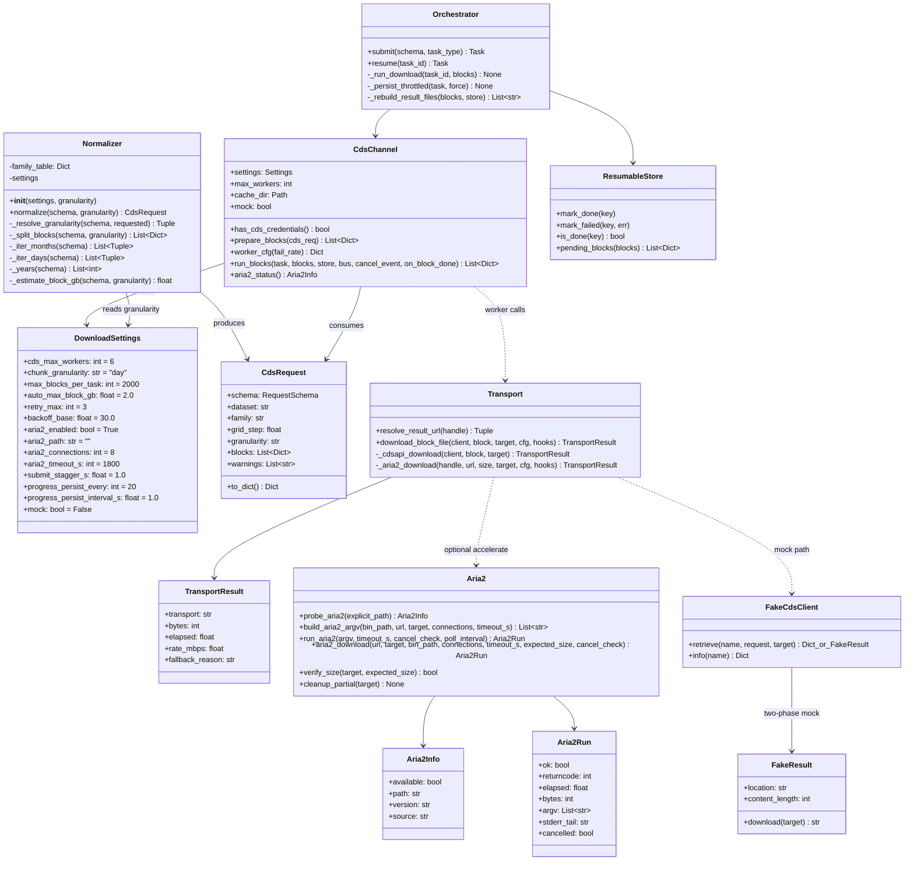
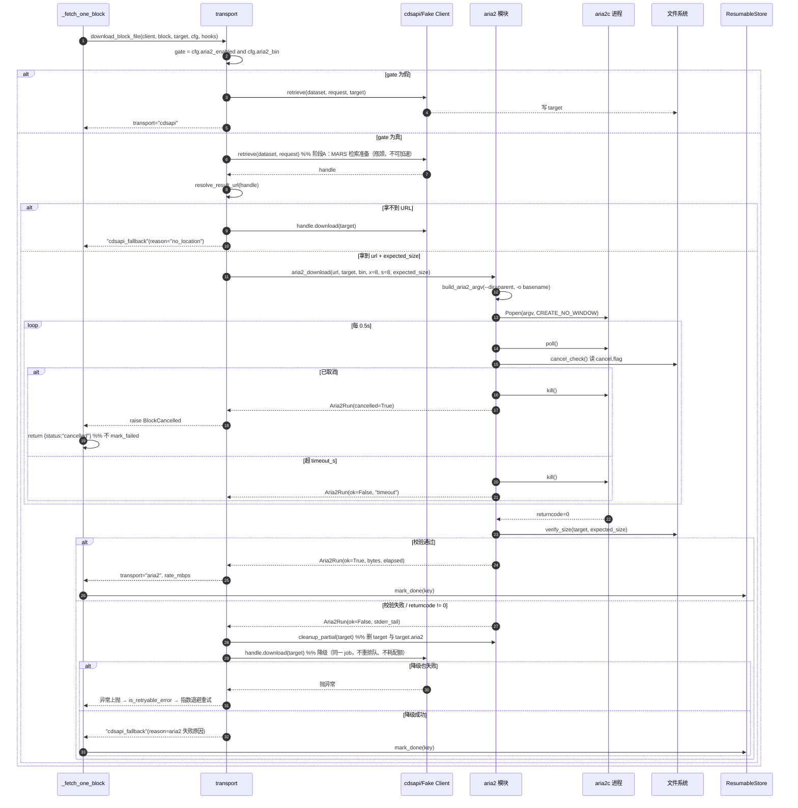
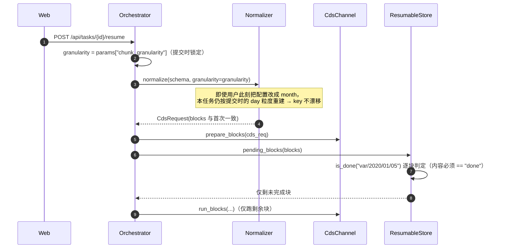
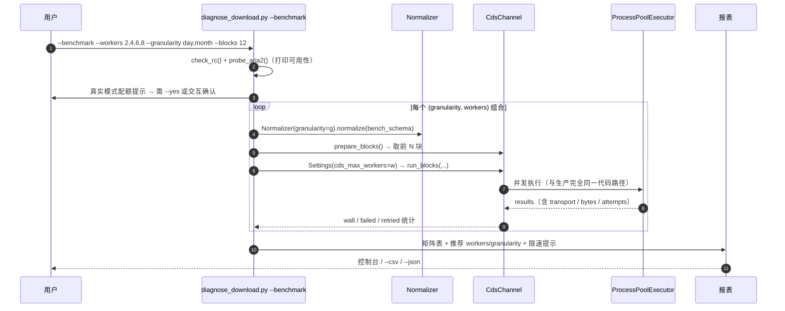
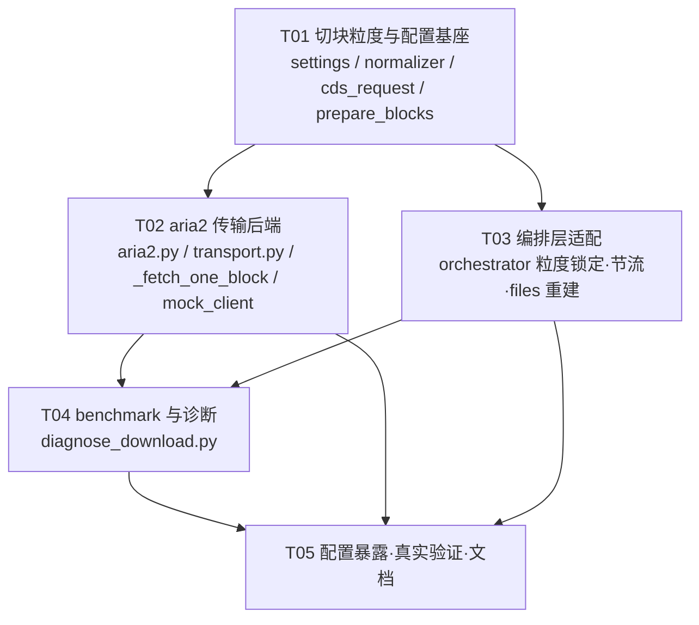

# ERA5 下载加速 — 系统设计 + 任务分解

> 架构师：高见远（Gao） · 基线：ERA5-AItool（FastAPI + cdsapi + React） · 目标：在**单 CDS key** 前提下最大化下载吞吐，且不破坏现有断点续传 / 进度事件 / 取消 / 进程池加固。
> 本文所有"现状"结论均已读源码核实（含 `.venv` 内 `cdsapi 0.7.7`、`ecmwf-datastores-client 0.5.3` 的真实返回对象）。

---

## 1. 实现方案与框架选型

### 1.1 加速杠杆与本方案对应关系

| 调研结论 | 本方案落点 | 预期收益 | 风险 |
|---|---|---|---|
| 请求拆细 + 多进程并行（单 key 最有效） | `Normalizer._split_blocks()` 新增 **day 粒度**；块数 12 → 365/年·变量 | 并发不再被块数饿死；失败隔离到天 | 请求数 ×30 → 固定排队开销放大（见 §1.4 反向风险） |
| 按天切分 | `chunk_granularity = day\|month\|auto`（hourly 生效） | 负载均衡、块体积均匀 | 小区域请求可能变慢 → 用 benchmark 实测 |
| aria2 多连接传输 | 新增 `acquisition/aria2.py` + `cds_channel` 两阶段传输 | 传输阶段 3–5×（大文件显著） | 需本机二进制 → **探测不到即降级** |
| 多 API key | **不适用**（仅 1 key），不实现 | — | — |
| 瓶颈在服务端 MARS 准备 | 主杠杆=拆细+并发；aria2 为传输侧增强；两者独立开关 | — | — |

### 1.2 选型（零重依赖）

| 关注点 | 选型 | 理由 |
|---|---|---|
| 并发模型 | 复用现有 `ProcessPoolExecutor`（不改架构） | 已有取消/BrokenProcessPool 加固，改动面最小 |
| 传输加速 | `subprocess.Popen` 调 `aria2c` 外部二进制 | 无新 Python 依赖；进程隔离，崩溃不影响 worker |
| aria2 探测 | `shutil.which`（标准库） | 无需新包 |
| 日期切块 | `datetime.date` + `calendar.monthrange`（标准库） | 避免 2 月 30 日等非法日 → CDS 400 |
| 下载 URL 获取 | cdsapi/datastores 句柄的 `.location` / `.content_length`（鸭子类型） | 已核实两类客户端都有（§3.4） |
| 基准测试 | 扩展 `scripts/diagnose_download.py`，复用 `CdsChannel.run_blocks` 真实链路 | 测的就是生产代码路径，不写第二套调度器 |
| 架构模式 | 分层不变：`API → Orchestrator → CdsChannel → transport(aria2\|cdsapi)`；新增 transport 为**策略层** | 传输策略可替换、可单测、可降级 |

### 1.3 三个加速开关（互相独立，可单独回退）

```
① 切块粒度  download.chunk_granularity = "day"（默认，hourly 生效）
② 并发度    download.cds_max_workers   = 6（4 → 6，区间 1–16 不变）
③ 传输后端  download.aria2_enabled     = true（探测不到 aria2c 自动降级）
```
任一开关出问题 → 改 `config/settings.json` 单个字段即可回到今天的行为（`month` / `4` / `false`）。

### 1.4 必须写进设计的反向风险（块大小 ↔ 并发度匹配）

CDS 单请求成本 ≈ **固定排队/准备开销（20–60s）+ 数据量相关时间**。按天切分把"数据量时间"切成 1/30，但**固定开销乘以 30 倍**：

| 场景 | month 粒度 | day 粒度 | 结论 |
|---|---|---|---|
| 1 变量 × 1 年 × 5°×5° 小区域 | 12 请求 / 4 并发 ≈ 3 轮 | 365 请求 / 6 并发 ≈ 61 轮 | **day 可能显著更慢**（固定开销主导） |
| 1 变量 × 1 年 × 全球 0.25° | 12 请求（每块数 GB）/ 4 并发 | 365 请求（每块百 MB）/ 6 并发 | day 明显更快（并发饱和 + 负载均衡） |
| 1 变量 × 1 个月 | 1 请求 → **并发度 1** | 28–31 请求 / 6 并发 | day 必然更快 |

**设计对策（三层保险）**：
1. 提供 `auto` 模式（推荐值，见 §8-①）：`month` 块数 ≥ `2 × workers` 且单块估算体积 ≤ `auto_max_block_gb` → 用 month，否则用 day。
2. 提供 `max_blocks_per_task` 熔断（默认 2000）：day 切块超限自动降级 month 并 warning，防止一次提交打出上万请求。
3. `--benchmark` 支持 `--granularity day,month` 双轴对比 → 用实测数据决定最终默认值。

> 按用户拍板：**默认仍为 `day`**；但 `auto` 与熔断同期实现，benchmark 出数后建议把默认改成 `auto`（§8-①）。

### 1.5 aria2 两阶段传输（关键设计）

现状 `_fetch_one_block` 只有一句 `client.retrieve(dataset, request, target)`（提交+等待+下载三合一）。改为**两阶段**：

```
阶段A（服务端准备，不可加速）： handle = client.retrieve(dataset, request)      # 不传 target
阶段B（传输，可加速）：         url, size = resolve_result_url(handle)
                               aria2c -x8 -s8 --dir=<parent> -o <name> <url>
                               校验 size → 通过则 mark_done
                               任一步失败 → handle.download(target)  ← 降级，不重新排队
```

已核实（这是方案可行性的地基）：

| 客户端（由 `~/.cdsapirc` 的 key 形态自动选择） | `retrieve(name, request)` 返回 | URL / 大小 | 降级下载 |
|---|---|---|---|
| `cdsapi.api.Client`（key 含冒号 UID:KEY） | `Result` | `.location`（`api.py:207` urljoin 绝对化）/ `.content_length`（`:203`） | `.download(target)`（`:199`） |
| `ecmwf.datastores.LegacyClient`（新 token） | `Results`（`legacy_client.py:163-178`，`wait_until_complete=True` 默认） | `.location`（`processing.py:684`=`asset["href"]`）/ `.content_length`（`:690`=`asset["file:size"]`） | `.download(target)`（`:654`） |
| 同上，`wait_until_complete=False` | `Remote` | 无 `.location` → `.get_results()` 得 `Results` | `.download(target)`（`:498`） |
| `FakeCdsClient`（mock） | 需**新增**两阶段模式返回 `FakeResult`（同名属性） | `.location`（`file://` 或 stub URL）/ `.content_length` | `.download(target)` |

**降级零成本**：阶段A 已完成的 CDS job 结果在服务端就绪，降级只是换个下载器拉同一个 URL —— 不重新提交、不重排队、不额外消耗配额。

**副作用提示**：`cdsapi.Client(delete=True)` 默认在 `Result.download()` 后 DELETE 服务端结果（`api.py:103/242/272`）。aria2 路径不调 `Result.download()` → 服务端结果由 CDS TTL 自然回收（无害，但会在 CDS 侧多留一段时间）。如需保持清理，可在 aria2 成功后显式调 `handle.delete()`（best-effort，失败忽略）。

### 1.6 不破坏既有能力的硬约束（逐条对应）

| 既有能力 | 保持方式 |
|---|---|
| 断点续传 `mark_done/mark_failed/pending_blocks` | key 规则扩展但**语义不变**；day key 多一层 `/{dd}`，`ResumableStore` 代码零改动（`marker_path` 已 `ensure_dir(parent)`） |
| 进度事件 / WS | `run_blocks` 的 progress 事件逻辑不动；新增 `transport`/`rate_mbps` 字段（附加字段，前端可忽略） |
| 取消 | `cancel.flag` 检查保留；**并增强**：aria2 子进程用 `Popen`+轮询 `cancel_check()` → 可秒级 kill（比 cdsapi 阻塞下载更快响应取消） |
| 进程池加固 | `run_blocks` 不改（BrokenProcessPool / shutdown(wait=False) 逻辑原样保留） |
| 可 mock 测试 | ① 传输逻辑抽到独立纯函数模块 `aria2.py` → 进程内直测；② `ERA5_ARIA2_CMD` 环境变量注入 stub（**spawn 子进程可继承 env**，monkeypatch 不行）；③ `FakeCdsClient` 支持两阶段句柄 → mock 也能跑完整 aria2 分支 |

---

## 2. 文件列表（相对项目根）

### 2.1 新建

| 路径 | 说明 |
|---|---|
| `backend/era5tool/acquisition/aria2.py` | aria2c 探测 / 命令构造 / 下载执行 / 结果校验（纯函数 + dataclass，无项目内依赖，可独立单测） |
| `backend/era5tool/acquisition/transport.py` | 传输策略编排：`resolve_result_url()` + `download_block_file()`（aria2 优先、失败降级 cdsapi），被 worker 调用 |
| `backend/tests/test_chunk_granularity.py` | day/month/auto 切块 + 日期裁剪 + 闰年 + 熔断 的单测 |
| `backend/tests/test_aria2_transport.py` | 探测/argv/校验/降级/取消 的单测（假 runner + stub 二进制） |
| `backend/tests/test_speedup_e2e_mock.py` | mock e2e：day 粒度全链路 SUCCESS + resume 一致性 + aria2 stub 分支 |
| `docs/design-speedup-download.md` | 本文档 |
| `docs/speedup-class-diagram.mermaid` | §3 类图（可独立渲染） |
| `docs/speedup-sequence-diagram.mermaid` | §4 时序图（可独立渲染） |

### 2.2 修改

| 路径 | 改动要点 | 风险 |
|---|---|---|
| `backend/era5tool/config/settings.py` | `DownloadSettings`：`cds_max_workers` 4→6；新增 `chunk_granularity` / `max_blocks_per_task` / `auto_max_block_gb` / `aria2_enabled` / `aria2_path` / `aria2_connections` / `aria2_timeout_s` / `submit_stagger_s` / `progress_persist_every` / `progress_persist_interval_s` | 低（全部带默认值，旧 settings.json 兼容） |
| `backend/era5tool/core/normalizer.py` | `_split_blocks` 支持 day/month/auto + **按 timerange 裁剪** + `calendar` 合法日 + 块数熔断；`CdsRequest` 新增 `granularity` 字段；`normalize(schema, granularity=None)` | **中**（改变块数 → 影响既有断言，见 T01 验收） |
| `backend/era5tool/acquisition/cds_request.py` | `build_cds_request(..., day=None)` 便捷参数（内部转 `day_block=(day,day)`），`day_block` 保留兼容 | 低（向后兼容，老测试不动） |
| `backend/era5tool/acquisition/cds_channel.py` | ①`prepare_blocks` 生成 day 请求 + `rel_target` 加 `/{dd}`；②`worker_cfg` 下发 aria2/stagger 配置；③`_fetch_one_block` 把 `client.retrieve(...)` 换成 `transport.download_block_file(...)`；④`run_blocks` **不改** | **中**（下载主路径） |
| `backend/era5tool/core/orchestrator.py` | ①`submit` 持久化 `chunk_granularity`，`resume` 用持久化值重建块（防粒度漂移导致全量重下）；②`params["blocks"]` 瘦身（不存 `request`）；③`_on_block_done` 落盘节流；④`result.files` 由 manifest+rel_target 全量重建 | **中**（状态机/续传） |
| `backend/era5tool/acquisition/mock_client.py` | `FakeCdsClient.retrieve(target=None)` 返回 `FakeResult`（`.location/.content_length/.download`），对齐真实两阶段语义 | 低（新增分支，`target` 传值行为不变） |
| `backend/scripts/diagnose_download.py` | 新增 `--benchmark`、`--workers 2,4,6,8`、`--granularity day,month`、`--blocks N`、`--probe-aria2`、`--csv`、`--yes`；输出并发×粒度矩阵与推荐值 | 低（脚本，不影响服务） |
| `backend/tests/test_normalizer.py` | 月粒度断言显式 `Normalizer(granularity="month")`；新增 day 断言 | 低 |
| `backend/tests/test_qa_cds_day_regression.py` | `len(blocks)==12` 处显式 month 粒度；新增 day 粒度"每块 day 恰 1 天"断言 | 低 |
| `backend/tests/test_qa_progress_and_blocks.py` / `test_qa_independent_verify.py` | `len(blocks)==24` 处显式 month 粒度（保持 e2e 快） | 低 |
| `backend/tests/conftest.py` | 测试默认 `chunk_granularity="month"`、`aria2_enabled=False`（保持既有 e2e 快且不触发外部二进制） | 低 |
| `web/src/types.ts` | `DownloadConfig` 补齐新字段（可选属性） | 低 |
| `web/src/pages/ConfigPage.tsx` | 并发滑杆默认/上限展示、粒度下拉、aria2 状态徽标（只读） | 低 |
| `README.md` | 加速用法 + benchmark 用法 + aria2 安装说明（Windows/conda/apt） | 低 |

---

## 3. 数据结构与接口

### 3.1 类图（新增/改动部分；未标注即为原样保留）



说明：`Transport` / `Aria2` 为模块级函数集合（无状态），用 class 框仅为在类图中表达归属；实现上是纯函数 + dataclass，便于进程内单测与跨进程复用。

### 3.2 切块：`normalizer.py` 关键签名与语义

```python
# CdsRequest 新增字段
granularity: str = "month"      # 实际生效值：day | month | monthly（monthly 家族固定）

class Normalizer:
    def __init__(self, settings=None, granularity: Optional[str] = None) -> None:
        """granularity 优先级：显式参数 > settings.download.chunk_granularity > "day"。"""

    def normalize(self, schema: RequestSchema,
                  granularity: Optional[str] = None) -> CdsRequest:
        """granularity 允许按任务覆盖（resume 传入持久化值，防粒度漂移）。"""

    def _resolve_granularity(self, schema: RequestSchema,
                             requested: str) -> Tuple[str, List[str]]:
        """返回 (生效粒度, warnings)：
        1) monthly 家族（era5-monthly / land-monthly）→ 固定 "monthly"（忽略请求值）；
        2) requested == "auto" → 若 month 块数 >= 2*cds_max_workers 且
           _estimate_block_gb(month) <= auto_max_block_gb → "month"，否则 "day"；
        3) requested == "day" 且 day 块数 > max_blocks_per_task → 降级 "month" + warning
           （熔断：防止一次提交打出上万个 CDS 请求）。
        """

    def _split_blocks(self, schema: RequestSchema,
                      granularity: str) -> List[Dict[str, Any]]:
        """块结构（新增 day 字段；month / monthly 形状与今天完全一致）：
        day     : {"key": f"{var}/{year}/{mm}/{dd}", "variable", "year", "month", "day"}
        month   : {"key": f"{var}/{year}/{mm}",      "variable", "year", "month", "day": None}
        monthly : {"key": f"{var}/{year}",           "variable", "year", "month": None, "day": None}
        """

    def _iter_months(self, schema) -> List[Tuple[int, int]]:
        """与 timerange 有交集的 (year, month) 列表（新增裁剪）。"""

    def _iter_days(self, schema) -> List[Tuple[int, int, int]]:
        """[start, end] 闭区间内每一天 (year, month, day)。用 date 逐日迭代，
        天数由 calendar.monthrange 保证合法（绝不产生 2 月 30 日 → CDS 400）。
        解析失败 → 回退整年 + warning（沿用 _years 的容错风格）。"""
```

**日期裁剪（行为变更，必须知悉）**：现状 `_split_blocks` 无视 timerange 的月/日，固定生成 12 个月块。例如请求 `2020-01-01..2020-03-15`，今天会下载整年 12 个月。改造后：

| timerange | 今天 | month 粒度（改造后） | day 粒度（改造后） |
|---|---|---|---|
| 2020-01-01..2020-12-31 | 12 块 | 12 块（不变） | 366 块（闰年） |
| 2020-01-01..2020-03-15 | 12 块（多下 9 个月） | 3 块 | 75 块 |
| 2020-06-01..2020-06-05 | 12 块 | 1 块（并发度只有 1！） | 5 块 |

裁剪既修掉"超量下载/浪费配额"，也是 day 粒度可用的前提（否则 5 天的请求会膨胀成 366 个请求）。month 粒度块内仍保持整月 `day=[01..31]`（不做月内裁剪，语义不变）。

### 3.3 CDS 请求构造：`cds_request.py`

```python
def build_cds_request(schema: RequestSchema, year: int,
                      month: Optional[int] = None,
                      day_block: Optional[Tuple[int, int]] = None,
                      variables: Optional[List[str]] = None,
                      day: Optional[int] = None) -> Dict[str, Any]:
    """新增 day（单日便捷参数）：
    - day 非空 → 等价 day_block=(day, day) → req["day"] == ["%02d" % day]；
    - day 与 day_block 同时给出 → day_block 优先（显式区间胜出），不报错；
    - hourly 家族 day/day_block 均为空 → 保持现状 day=["01".."31"]（整月）；
    - monthly 家族一律不写 day（现有 3 个回归断言继续通过）。
    """
```

> 关键发现：`day_block` **早已存在**且已有回归测试覆盖（`test_qa_cds_day_regression.py::test_day_block_single_day`），因此 day 粒度在请求侧几乎零风险——只需 `prepare_blocks` 开始传值。新增 `day=` 仅为调用可读性，向后兼容。

### 3.4 通道与传输：`cds_channel.py` / `transport.py` / `aria2.py`

```python
# ---------- cds_channel.py ----------
def prepare_blocks(self, cds_req: CdsRequest) -> List[Dict[str, Any]]:
    """按块粒度生成 request 与缓存相对路径：
    day     : build_cds_request(schema, year, month, variables=[var], day=b["day"])
              rel = dataset/var/hourly/{year}/{mm}/{dd}.nc
    month   : （不变）build_cds_request(schema, year, month, variables=[var])
              rel = dataset/var/hourly/{year}/{mm}.nc
    monthly : （不变）rel = dataset/var/monthly/{year}.nc
    """

def worker_cfg(self, fail_rate: float = 0.0) -> Dict[str, Any]:
    """新增下发字段（必须都是可 pickle 的基础类型，会跨进程传递）：
    aria2_enabled: bool   # settings.aria2_enabled AND 主进程探测成功（避免每块 which）
    aria2_bin: str        # 探测到的绝对路径（"" = 不可用）
    aria2_connections: int
    aria2_timeout_s: int
    submit_stagger_s: float
    """

def aria2_status(self) -> Aria2Info:
    """探测结果（供 /api/config 与诊断脚本展示），不抛异常。"""

def _fetch_one_block(args: tuple) -> Dict[str, Any]:
    """结构不变（重试/退避/取消检查/ensure_dir/事件全部保留），只替换下载一行：
      旧: client.retrieve(block["dataset"], block["request"], target)
      新: tr = download_block_file(client, block, target, cfg, hooks)
    返回值新增 transport / bytes / rate_mbps；
    status / attempts / retried / error / target 字段语义完全不变。
    可选：开头 time.sleep(random.uniform(0, cfg["submit_stagger_s"])) 抖动，
    削平 6 个 worker 同时 POST 造成的 429 突刺（mock 下自动置 0）。
    """

def run_blocks(...):
    """不改动（BrokenProcessPool 批量标记、shutdown(wait=False) 取消路径、
    on_block_done 回调、progress 事件全部原样保留）。"""

# ---------- transport.py ----------
def resolve_result_url(handle: Any) -> Tuple[Optional[str], Optional[int]]:
    """鸭子类型解析下载 URL 与期望字节数；不 import cdsapi（mock-only 环境可导入）：
    1) hasattr(handle, "location")     → (location, content_length)  # Result / Results / FakeResult
    2) hasattr(handle, "get_results")  → handle.get_results() 后同上  # datastores.Remote
    3) 其他（如 mock 返回的 dict）      → (None, None) → 走 cdsapi 路径
    任何异常 → (None, None)（URL 解析失败绝不能拖垮下载）。"""

def download_block_file(client, block: Dict[str, Any], target: str,
                        cfg: Dict[str, Any],
                        hooks: Optional["TransportHooks"] = None) -> TransportResult:
    """单块文件落地（worker 内调用，无全局状态，进程安全）。决策分支：
    A. not cfg["aria2_enabled"] or not cfg["aria2_bin"]
       → client.retrieve(dataset, request, target)          transport="cdsapi"
    B. 两阶段：
       handle = client.retrieve(dataset, request)            # 阶段A：等 CDS 服务端准备
       url, size = resolve_result_url(handle)
       url is None                → handle.download(target)  transport="cdsapi_fallback"
       run = aria2_download(url, target, bin_path=cfg["aria2_bin"],
                            connections=cfg["aria2_connections"],
                            timeout_s=cfg["aria2_timeout_s"],
                            expected_size=size,
                            cancel_check=hooks.cancel_check)
       run.cancelled              → raise BlockCancelled（_fetch_one_block 转 cancelled）
       run.ok and verify_size()   → transport="aria2"
       其他                        → cleanup_partial(target); handle.download(target)
                                     transport="cdsapi_fallback" + fallback_reason
    异常语义：只有【阶段A】或【最终降级下载】抛出的异常才向上传播，交给既有
    is_retryable_error + 指数退避处理；aria2 自身失败一律吞掉转降级，
    不消耗 retry 次数、不改变原有失败分类。"""

@dataclass
class TransportHooks:
    cancel_check: Optional[Callable[[], bool]] = None            # 读 cancel.flag
    on_log: Optional[Callable[[Dict[str, Any]], None]] = None    # emit_worker_event

# ---------- aria2.py（纯函数 + dataclass，零项目内依赖，可独立单测） ----------
ARIA2_BASE_ARGS = ("--allow-overwrite=true", "--auto-file-renaming=false",
                   "--continue=true", "--max-tries=2", "--retry-wait=3",
                   "--connect-timeout=15", "--timeout=60",
                   "--console-log-level=warn", "--summary-interval=0")

def probe_aria2(explicit_path: str = "") -> Aria2Info:
    """解析顺序：explicit_path(settings.aria2_path) → env ERA5_ARIA2_CMD
    → shutil.which("aria2c")；命中后执行 `<bin> --version` 取版本号
    （失败即 available=False）。全程不抛异常。
    env 注入是测试关键：ProcessPoolExecutor(spawn) 子进程继承环境变量，
    而 monkeypatch 无法穿透进程边界。"""

def build_aria2_argv(bin_path: str, url: str, target: str,
                     connections: int = 8, timeout_s: int = 1800) -> List[str]:
    """[bin, -x{n}, -s{n}, -k1M, --dir=<abspath(parent)>, -o <basename>,
       *ARIA2_BASE_ARGS, url]
    注意：aria2c 的 -o 是相对 --dir 的【文件名】，不能传路径（否则产物落错位置）。"""

def run_aria2(argv: List[str], timeout_s: int,
              cancel_check: Optional[Callable[[], bool]] = None,
              poll_interval: float = 0.5) -> Aria2Run:
    """Popen + 轮询（不用 subprocess.run，否则取消会被阻塞）：
    - 每 poll_interval 检查 cancel_check() → True 则 kill，Aria2Run.cancelled=True；
    - 超 timeout_s → kill，ok=False；
    - Windows 加 creationflags=CREATE_NO_WINDOW（打包应用不弹黑窗）；
    - stderr 仅保留尾部 500 字符（与现有 error 截断风格一致，防事件撑爆）。"""

def verify_size(target: str, expected_size: Optional[int]) -> bool:
    """expected_size 已知 → 必须精确相等（与 cdsapi/_check_size 同规则）；
    未知 → 仅要求文件存在且大小 > 0。"""

def cleanup_partial(target: str) -> None:
    """删除 target 与 target + ".aria2" 控制文件（降级前清场，
    避免半截文件冒充产物被 mark_done）。"""
```

### 3.5 编排层：`orchestrator.py`

```python
def submit(self, schema, task_type=TaskType.DOWNLOAD) -> Task:
    """新增：
    1) params["chunk_granularity"] = cds_req.granularity（用于 resume 与展示）
    2) params["warnings"] = cds_req.warnings（含裁剪/熔断提示，前端可展示）
    3) params["blocks"] = slim_blocks(blocks)   # 见 §7-③：不落 request 字典"""

def resume(self, task_id) -> Task:
    """新增：granularity = (task.params or {}).get("chunk_granularity") or 当前配置
    → normalizer.normalize(schema, granularity=granularity)
    ⇒ 用户中途改了配置也不会让块 key 变形 → 已完成块继续被跳过（续传不失效）。"""

def _persist_throttled(self, task: Task, force: bool = False) -> None:
    """落盘节流：满足 (已完成块数 % progress_persist_every == 0)
    或 (距上次落盘 >= progress_persist_interval_s) 或 force 时才 store.save(task)。
    WS/进度事件仍每块发送（不节流）→ 前端体验不变；末尾汇总 force=True。
    动机：day 粒度下 365~3000 块 × 每块全量 task.json 写盘 = 数百 MB 级无效 IO。"""

def _rebuild_result_files(self, blocks, store) -> List[str]:
    """result.files 改为按 blocks 的 rel_target + manifest(status==done) 全量重建，
    而不是只收集本轮 results 中的 done。现状在 resume 之后 files 会丢掉上一轮已完成
    的块 → plot_routes 拿到的文件不全 → open_mfdataset 出图缺数据。day 粒度使
    resume 场景变成常态，顺带修掉（P1）。"""
```

### 3.6 基准脚本：`scripts/diagnose_download.py`

```python
# 新增 CLI（默认行为不变：不带 --benchmark 仍是单请求诊断）
--benchmark                  # 基准模式
--workers 2,4,6,8            # 并发轴
--granularity day,month      # 粒度轴（day=单日块，month=整月块）
--blocks 12                  # 每个用例跑的块数（真实模式建议 <= 12，控配额）
--var 2m_temperature --year 2024 --month 1 --area 30,110,25,115
--mock                       # 离线 FakeCdsClient（CI 可跑，验证脚本自身）
--probe-aria2                # 仅探测 aria2c，打印 可用/路径/版本/来源
--csv out.csv --json         # 机器可读输出
--yes                        # 真实模式免交互确认（默认先打印配额提示并要求确认）

def build_bench_blocks(granularity: str, n: int, ...) -> List[Dict[str, Any]]:
    """用生产链路造块：RequestSchema → Normalizer(granularity=...)
    → CdsChannel.prepare_blocks → 取前 n 块。绝不另写一套请求构造逻辑。"""

def run_bench_case(workers: int, granularity: str, blocks, mock: bool) -> BenchCase:
    """临时 task_dir / cache_dir + Settings 覆盖(cds_max_workers=workers)
    → CdsChannel.run_blocks(...)（跑的就是生产调度器：重试/事件/断点续传全在）
    → 统计 wall / throughput(块每分钟) / avg_block / failed / retried /
      transport 分布(aria2 vs cdsapi) / 总字节 / 平均速率。
    注意：EventBroker() 不 bind_loop → schedule_broadcast 直接 return，
    因此无需启动 FastAPI 即可复用真实事件管道。"""

def print_bench_report(cases: List[BenchCase]) -> int:
    """矩阵表 + 推荐值：在 failed==0 的用例中取吞吐最高者；
    若最优点落在 workers 上限 → 提示"可继续上调"；
    若重试率 > 20%（疑似 429）→ 提示"已触限速，不建议再加并发"。"""
```

示例输出（形状约定，供工程师对齐）：

```
 ERA5-AItool 下载基准（mock=False, blocks=12, aria2=可用 1.37.0）
------------------------------------------------------------------------------
 粒度    并发   总耗时     吞吐(块/分)  单块均值   失败  重试  传输(aria2/cdsapi)
 day     2      412.3s     1.75         68.2s      0     0     12/0
 day     4      231.8s     3.11         71.4s      0     1     12/0
 day     6      179.5s     4.01         74.9s      0     2     11/1
 day     8      175.2s     4.11         98.6s      0     6     10/2
 month   4      388.6s     1.85        123.1s      0     0     12/0
------------------------------------------------------------------------------
 推荐：granularity=day, cds_max_workers=6（吞吐 4.01 块/分，0 失败）
 提示：workers=8 吞吐仅 +2.5% 但重试 6 次（疑似 429），不建议继续上调。
```

---

## 4. 程序调用流程（时序图）

### 4.1 主流程：提交 → day 切块 → 并发下载（aria2 / cdsapi 分支）

```mermaid
sequenceDiagram
    autonumber
    participant UI as Web (TasksPage)
    participant API as download_routes
    participant ORC as Orchestrator
    participant NRM as Normalizer
    participant CH as CdsChannel (主进程)
    participant A2 as aria2.probe_aria2
    participant POOL as ProcessPoolExecutor
    participant W as _fetch_one_block (worker)
    participant TR as transport.download_block_file
    participant CDS as cdsapi Client / CDS 服务端
    participant ARIA as aria2c 子进程
    participant ST as ResumableStore
    participant BUS as TaskEventBus

    UI->>API: POST /api/tasks {request_schema}
    API->>ORC: submit(schema)
    ORC->>NRM: normalize(schema)
    NRM->>NRM: _resolve_granularity → "day"（熔断/auto 判定）
    NRM->>NRM: _iter_days(timerange) + calendar.monthrange
    NRM-->>ORC: CdsRequest(granularity="day", blocks=[365 块])
    ORC->>CH: prepare_blocks(cds_req)
    CH->>CH: build_cds_request(..., day=dd) + rel=.../{year}/{mm}/{dd}.nc
    CH-->>ORC: prepared blocks
    ORC->>ORC: params[chunk_granularity]="day"; params[blocks]=slim_blocks
    ORC-->>API: Task(pending, block_stats.total=365)
    API-->>UI: {code:0, data:task}

    ORC->>ORC: Thread(_run_download)
    ORC->>ST: pending_blocks(blocks)  %% 断点续传：跳过 .done
    ST-->>ORC: pending（未完成块）
    ORC->>CH: aria2_status()
    CH->>A2: probe_aria2(settings.aria2_path)
    A2-->>CH: Aria2Info(available, path, version, source)
    ORC->>BUS: start() + status running
    ORC->>CH: run_blocks(task, pending, store, bus, cancel_event, on_block_done)
    CH->>CH: worker_cfg() 注入 aria2_enabled/aria2_bin/连接数/超时
    CH->>POOL: submit(_fetch_one_block, (block, cfg, task_dir, cache_dir, task_id)) × N

    loop 每块（worker 内，最多 retry_max 次）
        POOL->>W: 执行块
        W->>W: 检查 cancel.flag → 命中则返回 cancelled
        W->>W: ensure_dir(dirname(target))
        W->>TR: download_block_file(client, block, target, cfg, hooks)
        alt aria2 可用且非 mock 默认关闭
            TR->>CDS: retrieve(dataset, request)  %% 阶段A：不传 target
            CDS-->>TR: Result / Results 句柄（job completed）
            TR->>TR: resolve_result_url(handle) → (url, size)
            TR->>ARIA: aria2c -x8 -s8 --dir=parent -o name url
            ARIA-->>TR: returncode / 落盘文件
            TR->>TR: verify_size(target, size)
            alt 成功
                TR-->>W: TransportResult(transport="aria2", rate_mbps)
            else 失败/URL 缺失/大小不符
                TR->>TR: cleanup_partial(target)
                TR->>CDS: handle.download(target)  %% 降级：同一 job，不重排队
                CDS-->>TR: 文件落盘
                TR-->>W: TransportResult("cdsapi_fallback", fallback_reason)
            end
        else 默认路径（aria2 不可用 / mock）
            TR->>CDS: retrieve(dataset, request, target)
            CDS-->>TR: 文件落盘
            TR-->>W: TransportResult(transport="cdsapi")
        end
        W->>ST: mark_done(key)   %% key = var/year/mm/dd
        W->>BUS: emit_worker_event(log: 完成, transport, rate)
        W-->>POOL: {status:"done", attempts, target, transport, bytes}
    end

    POOL-->>CH: as_completed 结果
    CH->>BUS: emit(progress: 块 i/365)
    CH->>ORC: on_block_done(result, completed, total)
    ORC->>ORC: block_stats 累加 + progress
    ORC->>ORC: _persist_throttled(task)  %% 节流落盘（事件不节流）
    CH-->>ORC: results[]
    ORC->>ST: save(manifest)
    ORC->>ORC: _rebuild_result_files(blocks, store) → result.files（全量）
    ORC->>ORC: _persist_throttled(task, force=True)
    ORC->>BUS: emit(status: success / failed / paused)
    BUS-->>UI: WS 事件（progress / status / done）
```

### 4.2 aria2 路径细节：探测 → 拿 URL → 下载 → 校验 → 降级 / 取消



### 4.3 断点续传 / 粒度锁定（resume）



### 4.4 基准模式（benchmark）



---

## 5. 任务列表（有序，按实现顺序；≤5 个任务）

> 原则：T01 是所有人的地基（配置 + 切块 + 请求构造），必须先落；T02（传输）与 T03（编排）都只依赖 T01，可并行；T04 依赖 T02+T03（要测真实链路）；T05 收口。
> 每个任务**必须自带 mock 测试**，且"全量 pytest 通过"是硬验收（现有 30+ 用例一个都不许挂）。

### T01 · 切块粒度与配置基座（P0）

| 项 | 内容 |
|---|---|
| 目标 | hourly 支持 day 粒度切块（含 timerange 裁剪、合法日历日、块数熔断），并发默认 4→6，新增全部配置项 |
| 改动文件 | `backend/era5tool/config/settings.py`（`DownloadSettings` 新增 9 个字段 + `cds_max_workers=6`）<br>`backend/era5tool/core/normalizer.py`（`CdsRequest.granularity`、`normalize(granularity=)`、`_resolve_granularity`、`_iter_months`、`_iter_days`、`_split_blocks`、`_estimate_block_gb`）<br>`backend/era5tool/acquisition/cds_request.py`（新增 `day=` 便捷参数）<br>`backend/era5tool/acquisition/cds_channel.py`（**仅** `prepare_blocks`：传 `day=`、`rel_target` 加 `/{dd}`）<br>`backend/tests/test_chunk_granularity.py`（新建）<br>`backend/tests/conftest.py`（测试默认 `chunk_granularity="month"`、`aria2_enabled=False`）<br>`backend/tests/test_normalizer.py`、`test_qa_cds_day_regression.py`、`test_qa_progress_and_blocks.py`、`test_qa_independent_verify.py`（月粒度断言处显式 `Normalizer(granularity="month")`，并各补 1 条 day 断言） |
| 依赖 | 无 |
| 验收点 | ① 1 变量 × 2020 全年 day → **366** 块；2019 → **365** 块；`key == "2m_temperature/2020/01/01"`；每块 `request["day"] == ["01"]`、`request["month"] == ["01"]`、`len(request["time"]) == 24`、`request["variable"] == [该块变量]`<br>② 闰年/短月：2019-02 只生成 28 块，2020-02 生成 29 块（**绝不出现 2 月 30 日**）<br>③ 裁剪：`2020-06-01..2020-06-05` → day 5 块 / month 1 块；`2020-01-01..2020-03-15` → day 75 块 / month 3 块<br>④ monthly 家族（`era5-monthly`/`land-monthly`）：仍为 变量×年，key 无 `/mm`，request 无 `day`（原 3 条回归断言不改照过）<br>⑤ 熔断：day 块数 > `max_blocks_per_task` → 自动降级 month，`cds_req.warnings` 含中文提示，`granularity == "month"`<br>⑥ auto：1 变量 × 1 个月 → `"day"`；1 变量 × 1 年（12 ≥ 2×6）→ `"month"`<br>⑦ `rel_target == "reanalysis-era5-single-levels/2m_temperature/hourly/2020/01/01.nc"`；`ResumableStore.mark_done/is_done/mark_failed` 对 day key 正常（父目录自动创建）<br>⑧ 旧 `config/settings.json`（无新字段）可正常 `Settings.load()`，`cds_max_workers` 默认读到 **6**（文件里写 4 时仍以文件为准）<br>⑨ **全量 `pytest backend/tests` 通过** |
| 回退 | `chunk_granularity="month"` + `cds_max_workers=4` → 完全回到今天行为 |

### T02 · aria2 传输后端与优雅降级（P0）

| 项 | 内容 |
|---|---|
| 目标 | 传输阶段可用 aria2c 多连接加速；探测不到/失败/校验不过一律无损降级 cdsapi；取消可秒级响应 |
| 改动文件 | `backend/era5tool/acquisition/aria2.py`（新建：`probe_aria2` / `build_aria2_argv` / `run_aria2` / `aria2_download` / `verify_size` / `cleanup_partial` / `Aria2Info` / `Aria2Run`）<br>`backend/era5tool/acquisition/transport.py`（新建：`resolve_result_url` / `download_block_file` / `TransportResult` / `TransportHooks` / `BlockCancelled`）<br>`backend/era5tool/acquisition/cds_channel.py`（`worker_cfg` 下发 aria2 配置；`_fetch_one_block` 替换下载一行 + 可选 stagger；新增 `aria2_status()`；**`run_blocks` 一行不改**）<br>`backend/era5tool/acquisition/mock_client.py`（`retrieve(target=None)` → `FakeResult(location/content_length/download)`）<br>`backend/tests/test_aria2_transport.py`（新建） |
| 依赖 | T01（需要 day 块与新配置字段） |
| 验收点 | ① `probe_aria2` 优先级 `settings.aria2_path` → `ERA5_ARIA2_CMD` → `which("aria2c")`；全不可用 → `available=False` 且**不抛异常**<br>② `build_aria2_argv`：`-x{n} -s{n}` 取 `aria2_connections`、`--dir` 为 target 的**绝对父目录**、`-o` 为**纯文件名**、url 在末位、含 `--allow-overwrite/--auto-file-renaming=false`<br>③ `resolve_result_url` 覆盖 4 类句柄：有 `.location`（Result/Results/FakeResult）→ 返回 (url, size)；只有 `.get_results()`（Remote）→ 先取 results；dict/None → `(None, None)`；属性访问抛异常 → `(None, None)`<br>④ 成功路径：`transport == "aria2"`，target 存在且大小 == `content_length`，返回 `rate_mbps > 0`<br>⑤ 降级路径（3 种）：`returncode != 0` / 大小不匹配 / `url is None` → 最终文件仍正确落盘，`transport == "cdsapi_fallback"` 且 `fallback_reason` 非空；**`attempts == 1`（不消耗重试次数）**；降级前 `target` 与 `target.aria2` 已被清理<br>⑥ 取消：`cancel_check` 返回 True → 子进程被 kill，块结果 `status == "cancelled"`，**未调用 `mark_failed`**<br>⑦ 关闭开关（`aria2_enabled=False`）时调用序列与改造前一致：`client.retrieve(dataset, request, target)` 单次调用（用 FakeCdsClient 的 `calls` 断言）<br>⑧ `ERA5_ARIA2_CMD` 指向 stub 脚本时，**mock e2e 能真实走通 aria2 分支**（证明 spawn worker 继承 env）<br>⑨ Windows 下不弹出控制台窗口（argv/creationflags 断言）<br>⑩ **全量 pytest 通过**（`test_cds_channel_retry` / `test_qa_retry_independent` / `test_qa_round2_p0_fix` 等重试与目录用例全绿） |
| 回退 | `aria2_enabled=false` |

### T03 · 编排层适配：粒度锁定 / 落盘节流 / files 重建（P0）

| 项 | 内容 |
|---|---|
| 目标 | 让 365~3000 块规模在编排层不产生 IO 与响应体膨胀，且断点续传在"配置被改"后依然有效 |
| 改动文件 | `backend/era5tool/core/orchestrator.py`（`submit` 落 `chunk_granularity`/`warnings`/slim blocks；`resume` 用锁定粒度；`_persist_throttled`；`_rebuild_result_files`）<br>`backend/era5tool/acquisition/cds_channel.py`（`prepare_blocks` 兼容 slim block 输入：能从 schema 重建 `request`，供 resume 复用）<br>`backend/tests/test_speedup_e2e_mock.py`（新建：day 粒度 e2e + resume + 节流 + files 重建）<br>`backend/tests/test_qa_orchestrator.py`（如有 params/blocks 形状断言则同步） |
| 依赖 | T01（可与 T02 并行开发，合并顺序 T02 → T03 或反之皆可） |
| 验收点 | ① `task.params` 含 `chunk_granularity` 与 `warnings`；`params["blocks"]` **不含 `request` 字典**（断言 `"request" not in blocks[0]`）<br>② 粒度锁定：提交时 day → 运行中把配置改成 month → `resume` 后仍按 day 重建，已完成块被跳过（`block_stats.skipped == 首轮 done 数`，**无重复下载**）<br>③ 响应体：31 块任务 `GET /api/tasks/{id}` 序列化 < 50 KB（改造前含 request 约 15 KB/块）<br>④ 节流：mock 跑 120 块，`task.json` 写盘次数 ≤ `块数/progress_persist_every + 3`；而 `events.jsonl` 的 progress 行数 **== 块数**（事件不节流）<br>⑤ 终态正确性不变：全成功 → `SUCCESS` 且 `progress == 1.0`、`block_stats.done == total`；有失败 → `FAILED` + `failed_blocks`；取消 → `PAUSED` + `paused_blocks`<br>⑥ `result.files`：首轮完成 20 块 → 取消 → resume 完成剩余 → `len(files) == total`（改造前只有第二轮的数量）<br>⑦ 删除任务（`delete_files=true`）时 `cache/<dataset>/<var>/hourly/<year>/<mm>/` 整树被清理（`_delete_cache_files` 递归已覆盖，补 1 条断言即可）<br>⑧ **全量 pytest 通过** |
| 回退 | `progress_persist_every=1` + `progress_persist_interval_s=0` → 恢复每块落盘 |

### T04 · benchmark 与诊断脚本（P1）

| 项 | 内容 |
|---|---|
| 目标 | 让用户能**实测**选出最优 `workers × granularity`，并核对 aria2 是否真的生效 |
| 改动文件 | `backend/scripts/diagnose_download.py`（新增 `--benchmark/--workers/--granularity/--blocks/--probe-aria2/--csv/--yes` 与 `build_bench_blocks`/`run_bench_case`/`print_bench_report`）<br>`README.md`（加速与基准用法、aria2c 安装说明）<br>`docs/benchmark-results.md`（新建：实测结果留档模板 + 首次实测数据） |
| 依赖 | T02、T03 |
| 验收点 | ① `python scripts/diagnose_download.py --mock --benchmark --workers 2,4 --granularity day,month --blocks 6` 在 **60s 内**跑完，输出 4 行矩阵 + 推荐值，退出码 0<br>② `--probe-aria2` 打印 可用性/路径/版本/来源；未安装时给出 Windows/conda/apt 三种安装提示且退出码 0<br>③ `--json`/`--csv` 输出可被机器解析（字段：granularity, workers, wall_s, throughput_bpm, avg_block_s, failed, retried, transport_aria2, transport_cdsapi, bytes）<br>④ 真实模式无 `--yes` 时先打印配额估算并要求确认（防误刷配额）<br>⑤ 复用生产链路：断言 bench 块由 `Normalizer + prepare_blocks` 产出（day 用例每块 `request["day"]` 长度 == 1）<br>⑥ **不带 `--benchmark` 时行为与今天完全一致**（原诊断输出格式不变） |

### T05 · 配置暴露、真实验证与文档收口（P1）

| 项 | 内容 |
|---|---|
| 目标 | 用户可在界面上调这三个开关并看到 aria2 状态；用真实凭据验证端到端；把实测数字写回文档 |
| 改动文件 | `web/src/types.ts`（`DownloadConfig` 补新字段，全部 optional）<br>`web/src/pages/ConfigPage.tsx`（并发 1–16 滑杆、粒度下拉 `auto/day/month`、aria2 状态徽标只读）<br>`web/src/pages/OverviewPage.tsx`（并发文案跟随配置，可选）<br>`README.md` + `docs/design-speedup-download.md`（写回实测结论与最终默认值） |
| 依赖 | T01、T02、T03、T04 |
| 验收点 | ① `GET /api/config` 返回新字段；`PUT /api/config` 修改 `cds_max_workers`/`chunk_granularity` 后 `settings.json` 持久化且下次提交生效（配置热加载已有）<br>② 非法值被拒：`cds_max_workers=0/17` → 422/1001；`chunk_granularity="week"` → 参数错误<br>③ `npm run build` 通过，无 TS 报错<br>④ 真实凭据 e2e：1 变量 × 1 天 × 小区域 → 任务 SUCCESS，产物 `.nc` 可被 `/api/plot/render` 出图<br>⑤ 真实 benchmark 至少跑通 `workers=2,4,6` × `granularity=day,month`，结果填入 `docs/benchmark-results.md`，并据此确认/修正默认值<br>⑥ **全量 pytest 通过 + `docs` 更新完成** |

### 5.1 任务依赖图



### 5.2 实施顺序与最小可交付切片

| 阶段 | 完成后即可获得的收益 |
|---|---|
| T01 落地 | **主杠杆到手**：day 切块 + 6 并发（并顺带修掉整年超量下载）；此时已可实测提速 |
| T01+T03 | 大块数任务在编排层稳定（无 IO 膨胀、续传不漂移） |
| +T02 | 传输侧再加速（有 aria2c 才生效，无则零影响） |
| +T04 | 用数据说话，定最优参数 |
| +T05 | 用户可自助调参，文档/前端闭环 |

---

## 6. 依赖包清单

### 6.1 Python 依赖：**零新增**

| 用途 | 使用的库 | 说明 |
|---|---|---|
| aria2c 探测 | `shutil.which`（标准库） | 无需 `distutils`/第三方 |
| 子进程调用与取消 | `subprocess.Popen` / `os.kill`（标准库） | 不用 `subprocess.run`（会阻塞取消） |
| 日期迭代与合法天数 | `datetime.date` / `datetime.timedelta` / `calendar.monthrange`（标准库） | 避免非法日期导致 CDS 400 |
| 随机抖动（stagger） | `random`（标准库） | 削平并发 POST 突刺 |
| 已有依赖 | `cdsapi==0.7.7`、`ecmwf-datastores-client==0.5.3`（cdsapi 的传递依赖）、`pydantic` / `pydantic-settings`、`fastapi`、`xarray`/`matplotlib`（出图） | 版本不动 |
| 测试 | `pytest`（已有） | 不引入 `pytest-mock` 等 |

> `requirements.txt` / `pyproject.toml` **不需要修改**。这是选 aria2c 外部二进制而不是 Python 多线程分片库（如 `pySmartDL`）的直接理由之一。

### 6.2 外部可选二进制：`aria2c`（非 pip 包）

| 平台 | 安装方式 | 备注 |
|---|---|---|
| Windows | `winget install aria2.aria2` / `choco install aria2` / 官方 release 解压后加入 PATH，或把绝对路径填到 `download.aria2_path` | 本项目开发机为 Windows，`aria2_path` 兜底最稳 |
| conda 环境 | `conda install -c conda-forge aria2` | 与 `.venv` 并存时建议用 `aria2_path` 指定 |
| Linux | `apt install aria2` / `yum install aria2` | — |
| macOS | `brew install aria2` | — |

**未安装不影响功能**：`probe_aria2()` 返回 `available=False` → `worker_cfg` 下发 `aria2_bin=""` → 走 `client.retrieve(...)` 默认路径（与今天完全一致）。

### 6.3 测试用 stub（仓库内，非依赖）

| 文件 | 用途 |
|---|---|
| `backend/tests/_stub_aria2.py`（由 T02 创建，可放 `tests/` 下） | 假 aria2c：解析 `--dir/-o` 后写出内容，支持通过环境变量模拟 `returncode != 0` / 大小不符；通过 `ERA5_ARIA2_CMD="python <path>"` 注入 |

> 注意：`ERA5_ARIA2_CMD` 允许带参数（如 `python C:\...\_stub_aria2.py`），因此 `probe_aria2` 需支持 `shlex.split`（Windows 下用 `shlex.split(s, posix=False)` 或简单空格切分 + 引号处理），并让 `build_aria2_argv` 接受 `bin_argv: List[str]` 而非单一字符串。

---

## 7. 共享知识（跨文件约定，工程师必读）

### ① 块 key 命名规则（断点续传的唯一标识，改错即全量重下）

| 粒度 | key 形状 | 例 | `.done` 标记落点（`task_dir/{key}.done`） |
|---|---|---|---|
| day（hourly 默认） | `{var}/{year}/{mm}/{dd}` | `2m_temperature/2020/01/05` | `.../2m_temperature/2020/01/05.done` |
| month（hourly 可选） | `{var}/{year}/{mm}` | `2m_temperature/2020/01` | `.../2m_temperature/2020/01.done` |
| monthly 家族 | `{var}/{year}` | `2m_temperature/2020` | `.../2m_temperature/2020.done` |

- `mm`/`dd` 一律**两位零填充**（`f"{month:02d}"`），禁止 `1` 与 `01` 混用。
- 同一任务内 key 必须**全局唯一**且**可从 block 字段确定性重建**（resume 依赖这一点）。
- month 的 `01.done`（文件）与 day 的 `01/`（目录）**同级不冲突**（名字不同），无需迁移。

### ② 缓存路径规则

```
day     : data/cache/{dataset}/{var}/hourly/{year}/{mm}/{dd}.nc
month   : data/cache/{dataset}/{var}/hourly/{year}/{mm}.nc      （不变）
monthly : data/cache/{dataset}/{var}/monthly/{year}.nc          （不变）
```
- `freq` 段仍只有 `hourly` / `monthly` 两个取值（**不要**改成 `daily`，否则 `task_store._delete_cache_files` 与既有产物路径全部失配）。
- worker 内 `ensure_dir(os.path.dirname(target))` **必须保留**（真实 cdsapi 不建父目录，这是既有 P0 根因）；aria2 路径也要建，`--dir` 不会自动创建多级目录。
- 跨粒度**不复用**缓存：month 下过的 `01.nc` 不会让 day 的 31 块跳过（反之亦然）。切换粒度等于重下，需在前端/文档提示。

### ③ `params["blocks"]`（slim block）字段契约

```jsonc
// 落盘 / API 返回（不含 request，体积敏感）
{"key": "2m_temperature/2020/01/05", "variable": "2m_temperature",
 "year": 2020, "month": 1, "day": 5,
 "dataset": "reanalysis-era5-single-levels", "freq": "hourly",
 "rel_target": "reanalysis-era5-single-levels/2m_temperature/hourly/2020/01/05.nc"}
```
- 运行期由 `prepare_blocks` 补 `request`（可从 `request_schema` + 块字段确定性重建）。
- `month`/`day` 为 `None` 表示"该维度整体"（monthly 家族 / month 粒度），不要用 `0` 或 `""` 代替。

### ④ `worker_cfg` 契约（跨进程传递，必须可 pickle）

```python
{"mock", "mock_delay", "fail_rate", "seed",
 "retry_max", "backoff_base", "backoff_factor", "backoff_max", "backoff_jitter",   # 既有
 "aria2_enabled": bool, "aria2_bin": str, "aria2_connections": int,                 # 新增
 "aria2_timeout_s": int, "submit_stagger_s": float}
```
- 只放基础类型（`str/int/float/bool`），**禁止**放 `Settings`、`Path`、logger、句柄。
- aria2 探测在**主进程做一次**并把结果放进 cfg；worker 内不再 `which`（365 块 × which 是浪费，且结果必须一致）。

### ⑤ 块结果字典契约（`_fetch_one_block` 返回值）

```python
{"block": key, "status": "done|failed|cancelled", "attempts": int,
 "retried": bool, "error": str, "target": str,          # 既有字段，语义不变
 "transport": "aria2|cdsapi|cdsapi_fallback",           # 新增
 "bytes": int, "rate_mbps": float}                      # 新增
```
- 编排层只依赖 `status/retried/error/target`（**不要**改这四个字段的语义，否则 `failed_task_error` 与状态机判定会变）。
- 新增字段一律"可缺失"，消费方用 `.get()`。

### ⑥ 事件约定

- `run_blocks` 的 `progress` 事件字段不变（`block_key/block_index/block_total/progress`）。
- worker 的 `log` 事件可附加 `transport`、`rate_mbps`、`fallback_reason`；前端未识别的字段应忽略（现有 WS 处理即如此）。
- 事件文案继续用中文，错误串继续 **截断 200 字符**（aria2 的 `stderr_tail` 截断 500 后再进 error 时二次截断到 200）。

### ⑦ mock 与 real 的一致性约束（可测试性的地基）

| 约束 | 说明 |
|---|---|
| 签名对齐 | `FakeCdsClient.retrieve(name, request=None, target=None)`：`target` 给值 → 写文件返回 dict（现状）；`target=None` → 返回 `FakeResult`（新增），与 `cdsapi.Result` / `datastores.Results` 的 `.location/.content_length/.download(target)` 三件套同名同义 |
| 目录行为对齐 | `FakeResult.download()` 内部**也要** `ensure_dir`；同时 worker 侧照旧显式 `ensure_dir` —— 两边都做，避免 mock 掩盖真实缺陷（这是历史 P0 的教训） |
| 大小语义对齐 | `FakeResult.content_length` == 实际写入字节数，使 `verify_size` 在 mock 下走的是**真分支**而不是"未知大小"兜底 |
| aria2 在 mock 下默认关 | `conftest` 设 `aria2_enabled=False`；需要测 aria2 分支时显式打开 + `ERA5_ARIA2_CMD` 注入 stub（**唯一能穿透 spawn 子进程的注入方式**） |
| 退避加速 | 沿用现状：mock 下 `actual = min(wait*0.001, 0.05)`；aria2 的 `--retry-wait` 在 stub 下不生效，无需特殊处理 |

### ⑧ 配置兼容与热加载

- 所有新字段**必须有默认值**，`config/settings.json` 老文件（无这些键）要能直接加载（`Settings.load` 已用 `payload.update` + pydantic 默认值，天然兼容）。
- `Settings.save()` 会把 `download.model_dump()` 全量写回 → 首次保存后 `settings.json` 自动补齐新键，无需迁移脚本。
- `settings.download.mock` 与 `cds_max_workers` 是**运行时读取**（`CdsChannel.mock` 是 property；`max_workers` 在 `__init__` 取值）→ 若希望改并发立即生效，`run_blocks` 处改为 `self.settings.download.cds_max_workers`（可选小改，风险低，建议在 T02 顺手做并加断言）。

### ⑨ 环境变量

| 变量 | 用途 | 谁读 |
|---|---|---|
| `ERA5_CONFIG_DIR` / `ERA5_DATA_DIR` | 测试隔离（既有） | `Settings.load` |
| `ERA5_ARIA2_CMD` | 注入 aria2 可执行（含 stub），优先于 `which` | `probe_aria2` |

### ⑩ 编码风格（与现有代码一致）

- 文件头 `# -*- coding: utf-8 -*-` + `from __future__ import annotations`；模块 docstring 说明职责与对应设计条目。
- 中文注释，关键决策写"为什么"（尤其**降级/兜底**分支要写清根因，延续现有代码风格）。
- 异常分类只走 `is_retryable_error`（**不要**在 transport 层新造重试逻辑）。

---

## 8. 待明确事项（需用户/PM 确认）

| # | 事项 | 架构师建议 | 影响 |
|---|---|---|---|
| ① | **默认粒度用 `day` 还是 `auto`** | 先按拍板用 `day` 交付，`auto` 同期实现；T04 实测后建议把默认改成 `auto`（`month` 块数 ≥ 2×workers 且单块 ≤ 2 GB 时用 month）。理由见 §1.4：小区域请求下 day 会把固定排队开销放大 30 倍，可能比 month 慢数倍 | 决定最终默认值；只改 1 个配置字段，不影响代码结构 |
| ② | **月内裁剪要不要做** | day 粒度已精确到天；month 粒度块内仍是 `day=[01..31]`，即 `2020-01-01..2020-03-15` 的 3 月块会多下半个月。建议保持现状（改动小、语义稳），若在意配额可在首/末月改用 `day_block=(1,15)` | 配额与产物时间范围 |
| ③ | **aria2 连接数与 CDS 对端行为** | `-x8 -s8` 是文献常用值；若 CDS 对象存储不支持 `Range`，aria2 会退化为单连接（不是错误，**不得**判为失败）。需一次真实验证并把结论写入 `docs/benchmark-results.md`；若发现 4 连接就打满带宽，把默认降到 4 更礼貌 | aria2 实际增益；`aria2_connections` 默认值 |
| ④ | **两种凭据形态是否都能用 aria2** | `~/.cdsapirc` 的 key 含冒号 → 走老 `cdsapi.Client`（`Result.location` 指向 CDS 缓存 URL）；无冒号 token → 走 `LegacyClient`（`asset["href"]` 指向对象存储）。两者是否都能**免鉴权**直接被 aria2 拉取需真实验证；若某一路需要带 header，则该路自动降级（设计已覆盖），但会失去加速 | aria2 实际生效范围；建议 T02 完成后立刻用真实 key 各验一次 |
| ⑤ | **跨粒度缓存复用/迁移** | 不做（成本高、收益低）。建议在提交前端提示"切换切块粒度会导致已下载数据不被复用" | 用户预期管理 |
| ⑥ | **真实 benchmark 的配额预算** | 建议上限：`granularity∈{day,month} × workers∈{2,4,6}` × 6 块 × 小区域（5°×5°、1 变量、1 个 time step）≈ 36 个极小请求。是否可接受？若配额紧张可只测 `day × {4,6}` | 实测置信度 vs 配额消耗 |
| ⑦ | **365 文件出图性能** | `plot.engine._load_data` 用 `xr.open_mfdataset(candidates, combine="by_coords")`；day 粒度后单变量单年 = 365 个文件，打开开销与内存都会上升。建议 T05 顺带实测一次；必要时后续做"下载后按月合并"的产物归并（**本次不做**） | 出图链路体验（不阻塞下载加速交付） |
| ⑧ | **是否把 `transport`/速率展示到前端** | 建议 P2：任务详情里显示"传输方式 aria2 / 平均速率"，让加速可感知。本次仅后端埋字段 | 前端工作量 |
| ⑨ | **`submit_stagger_s` 是否保留** | 建议保留但默认 1.0s（相对单块数十秒的排队开销可忽略），可显著降低 6 并发同时 POST 的 429 概率；若实测无 429 可置 0 | 429 概率 |

---

## 附：与既有文档的关系

- 本文是 `docs/design-final.md` 的**增量设计**，只覆盖下载加速相关章节（§3.3 通道、§3.4 请求构造、§8.1/§8.2 任务与续传）；未提及处一律沿用 `design-final.md`。
- 类图 / 时序图已单独导出：`docs/speedup-class-diagram.mermaid`、`docs/speedup-sequence-diagram.mermaid`。
- 实测数据留档：`docs/benchmark-results.md`（T04 创建）。
