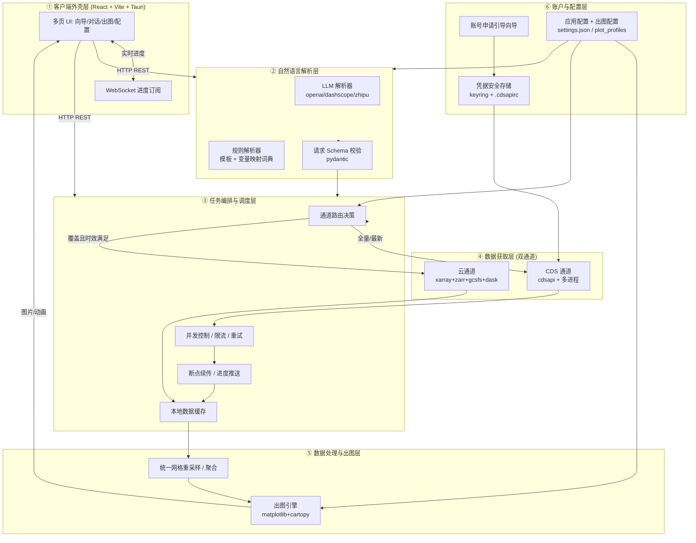
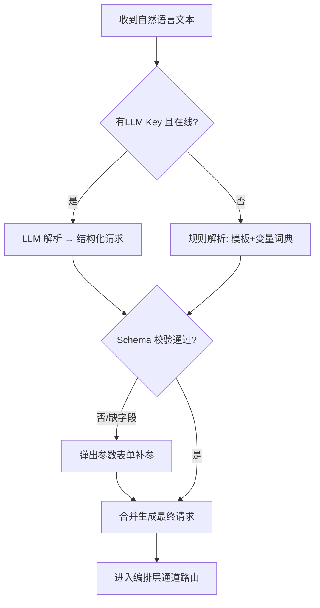
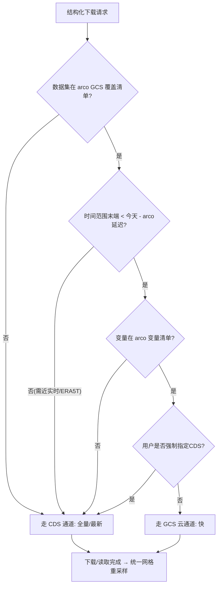
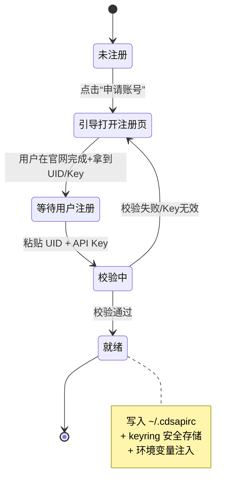
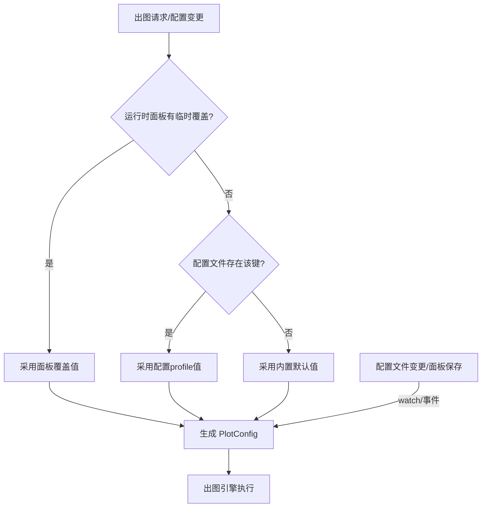

# ERA5 自然语言下载 + 出图工具 · 系统设计与开发清单

> 角色：架构师「高见远」 · 阶段：架构设计（仅设计，不写实现代码）
> 依据：产品经理「许清楚」竞品调研（AIForCDS / ERA5_Download / arco-era5 / ERA5-tools）
> 适用范围：本文件为后续工程化开发的蓝本，所有结论均可被 Engineer 直接落地。

---

## 1. 总体架构方案

### 1.1 推荐架构

采纳「**双数据通道 + 自然语言解析层 + GUI/Web 外壳 + 出图面板 + 账号向导**」的分层架构。核心思想是：

- **内核与外壳解耦**：所有数据能力（下载/解析/出图/账号）封装为 Python 后端服务，前端只负责交互与展示，可整体打包为桌面应用（Tauri/Electron）或作为纯 Web 部署。
- **双数据通道并行**：CDS 通道保「全量 + 最新」，云通道（arco-era5 的 GCS Zarr）保「快」。由路由层按「覆盖/时效/网格」自动选择，用户无感。
- **NL 解析双模**：有 LLM Key 走大模型；无 Key 或离线走「规则模板 + 中文→CDS 变量映射词典 + 参数表单」兜底，保证功能不塌陷。
- **出图配置外置**：变量映射、投影/底图、配色、聚合、输出格式均以配置文件 + 面板暴露，优先级可热加载。

### 1.2 架构图（组件与数据流）



### 1.3 各层职责

| 层 | 职责 | 关键能力 |
|---|---|---|
| ① 外壳层 | 用户交互、请求提交、进度/结果展示 | 傻瓜式向导、对话补参、出图配置面板、账号引导页 |
| ② NL 解析层 | 自然语言 → 结构化下载请求 | LLM 多轮澄清、规则兜底、变量中文→英文映射、Schema 校验 |
| ③ 编排层 | 请求落库、通道路由、并发/限流、断点续传、进度推送 | 任务状态机、失败重试、限速保护 |
| ④ 获取层 | 实际拉取数据 | CDS 多进程并行；GCS 直读惰性加载 |
| ⑤ 处理/出图层 | 数据规整与可视化 | 网格统一重采样、聚合、空间/时序/动画出图 |
| ⑥ 账户/配置层 | 凭据与配置治理 | 半自动账号引导、Key 安全存储、出图配置热加载 |

---

## 2. 前端技术选型清单

> 形态决策：**Web 优先，Tauri 桌面壳包裹**（内核为本地 FastAPI 服务 + 前端静态资源）。API 与内核彻底解耦，未来可一键切到纯 Web/云端部署。

| 技术 | 用途 | 选型理由 | 与后端交互 |
|---|---|---|---|
| **React 18 + TypeScript** | UI 框架 + 类型安全 | 生态成熟、组件丰富、TS 减少前后端接口错位 | — |
| **Vite** | 构建 / 本地开发服务器 | 启动快、HMR 顺滑 | — |
| **Tailwind CSS** | 原子化样式 | 快速统一视觉、低样式维护成本 | — |
| **MUI (Material UI)** | 现成组件库 | 表单、对话框、步骤条、向导组件开箱即用，适合“傻瓜式” | — |
| **Zustand** | 轻量状态管理 | 比 Redux 轻，适合中小应用与多面板共享状态 | — |
| **React Router** | 多页路由 | 向导/对话/出图/配置多视图切换 | — |
| **Tauri**（首选）/ Electron（备选） | 桌面外壳 | Tauri 体积小、Rust 安全、调用本地进程；Electron 兼容性好但包大 | 本地 `http://localhost:<port>` REST + WebSocket |
| **Axios** | HTTP 客户端 | 调用后端 REST API | REST |
| **WebSocket (原生 / SockJS)** | 实时进度/日志 | 下载进度条、任务日志流式推送 | WS |
| **ECharts / Plotly（可选）** | 前端缩略预览 | 大图后端出，前端仅做轻量预览/缩略 | 接收图片 URL 或 JSON |

**交互契约**：前端不直接调用 CDS/GCS，一律经后端 REST/WS。所有请求/响应遵循统一 `{code, data, message}` 包装（见第 8 节共享约定）。

---

## 3. 后端技术选型清单

> 运行形态：本地或云端 Python 服务（FastAPI），通过 REST + WebSocket 向外壳层暴露能力。

| 分组 | 技术 | 用途 | 选型理由 |
|---|---|---|---|
| 语言/框架 | **Python 3.11 + FastAPI** | REST/WS 服务 | 原生异步、自动 OpenAPI 文档、易与数据科学生态集成 |
| 并发模型 | **asyncio + multiprocessing / subprocess** | CDS 并行下载 | `cdsapi` 本质串行，必须多进程绕过；asyncio 管 IO 与调度 |
| 任务调度 | 内存任务表（初版）→ Celery/RQ（进阶） | 任务状态/队列 | 初版单用户本地，内存表足够；多用户再引入 |
| **CDS 通道** | `cdsapi` | 调 Copernicus CDS API | 官方客户端，支持全量数据集与最新数据 |
| **云通道** | `xarray` `zarr` `gcsfs` `fsspec` `dask` `cfgrib` | GCS 直读、惰性加载、列存切片 | arco-era5 快通道：Zarr 列存 + dask 懒加载 + 精细 chunk |
| **NL 层** | `openai` / `dashscope`(通义) / `zhipu-sdk`(GLM) | LLM 调用 | 抽象统一接口，可热插拔任意模型 |
| **NL 兜底** | 规则模板 + 中文→CDS 变量映射词典(`variable_map.json`) | 离线解析 | 无 Key/离线时保证可下载 |
| **出图层** | `matplotlib` `cartopy` `pandas` `netCDF4`/`cfgrib` | 空间/时序/动画 | 成熟、可控、出图可配置 |
| **账号** | `keyring` `python-dotenv` | 凭据安全存储/读取 | 钥匙串/系统凭据，绝不入库 |
| **配置** | `pydantic` `pydantic-settings` | 配置加载与校验 | 类型安全、Schema 约束 |
| **存储** | 本地文件系统 + `settings.json` + `.cdsapirc` | 缓存/配置 | 单用户本地无需外部 DB |
| **日志** | `structlog` / `logging` | 进度与审计日志 | 供 WebSocket 推送 |

**存储决策**：不引入数据库。下载产物存本地目录（按 数据集/变量/时空 分目录），配置与凭据存本地/钥匙串。多用户/云端阶段再评估数据库。

---

## 4. 逻辑条件（关键交付项）

### 4.1 自然语言解析成立条件（判定表）

| 条件 | 解析路径 | 说明 |
|---|---|---|
| 已配置 LLM Key **且** 网络可达 | **LLM 解析**：NL → JSON Schema → 多轮澄清 → 校验合并 | 体验最佳，支持模糊中文/英文 |
| 无 LLM Key **或** 网络失败 | **规则兜底**：模板匹配 + 变量映射词典 → 必填项缺失则弹参数表单 | 离线可用，覆盖常见句式 |
| 规则兜底仍缺关键参数 | **参数表单**：用户手动选 数据集/变量/时空/聚合 | 绝不阻塞，保证可下载 |



### 4.2 数据通道选择逻辑（路由判定）

路由目标：**时效优先用 CDS，速度优先且覆盖满足时用 GCS**。



**路由规则要点（判定表）**

| 数据集/场景 | 通道 | 原因 |
|---|---|---|
| 不在 arco 覆盖（如部分 ERA5-Land、气压层细分） | CDS | 云通道无覆盖 |
| 需要 ERA5T（近实时，延迟 ~1 周）或稳定版延迟不满足 | CDS | 云通道有延迟（稳定版 ~3 月） |
| 变量不在 arco 变量清单 | CDS | 云通道变量受限 |
| 普通历史 ERA5（AR 0.25°），时效容忍延迟 | **GCS** | 最快：Zarr+dask 直读 |
| 用户显式勾选“走 CDS” | CDS | 用户 override |
| arco CO 高斯网格数据 | GCS（读后重采样） | 出图前统一重采样到 0.25° 规则网格 |

### 4.3 账号申请辅助逻辑（半自动引导状态机）

CDS 注册含人机验证，**无法全自动**，采用“半自动引导”：工具引导用户到官网完成注册，再回贴 UID+Key，由工具写入 `.cdsapirc` 并存入钥匙串。



### 4.4 出图配置可改的生效逻辑（优先级 + 热加载）

**优先级（高 → 低）**：
1. 用户运行时在面板上的**临时覆盖**（仅本次出图）
2. 用户**配置文件** `plot_profiles/*.json`（`settings.json` 指向的当前 profile）
3. 内置**默认配置**（代码内常量，作为最后兜底）

**热加载**：监听配置文件变更（或面板“保存即生效”）→ 重新加载 `PlotConfig` 对象 → 下次出图立即生效，**无需重启服务**。



---

## 5. 文件 / 模块结构规划

> 仅列路径与职责，**不写代码**。

```
era5-AItool/
├── docs/                          # 设计文档（本文件 + 抽取图）
│   ├── system_design.md
│   ├── class-diagram.mermaid
│   └── sequence-diagram.mermaid
│
├── backend/                       # Python 后端服务
│   ├── pyproject.toml             # 依赖与版本锁定（区分 CDS/云 通道依赖）
│   ├── era5tool/
│   │   ├── main.py                # FastAPI 入口（启动 REST + WS）
│   │   ├── api/                   # 路由层
│   │   │   ├── nl_routes.py       # 自然语言解析接口
│   │   │   ├── download_routes.py # 下载/任务接口
│   │   │   ├── plot_routes.py     # 出图接口
│   │   │   ├── account_routes.py  # 账号向导接口
│   │   │   └── config_routes.py   # 配置读写接口
│   │   ├── core/                  # 编排层
│   │   │   ├── orchestrator.py    # 任务编排/状态机
│   │   │   ├── router.py          # 通道路由决策
│   │   │   ├── concurrency.py     # 并发/限流/重试
│   │   │   └── resumable.py       # 断点续传
│   │   ├── acquisition/           # 数据获取层
│   │   │   ├── cds_channel.py     # CDS 通道（多进程）
│   │   │   └── gcs_channel.py     # GCS 云通道
│   │   ├── nl/                    # 自然语言层
│   │   │   ├── parser.py          # 解析器抽象/调度
│   │   │   ├── llm_parser.py      # LLM 解析
│   │   │   ├── rule_parser.py     # 规则兜底
│   │   │   └── variable_map.json  # 中文→CDS 变量映射词典
│   │   ├── plot/                  # 出图层
│   │   │   ├── engine.py          # 出图引擎
│   │   │   ├── profiles/          # 出图配置 profile
│   │   │   ├── colormaps.py       # 配色
│   │   │   └── reproject.py       # 网格重采样/投影
│   │   ├── account/               # 账户层
│   │   │   ├── wizard.py          # 半自动引导状态机
│   │   │   └── keyring_store.py   # 凭据安全存储
│   │   ├── config/                # 配置层
│   │   │   ├── settings.py        # pydantic 配置加载
│   │   │   └── schema.py          # 请求/响应 Schema
│   │   ├── models/                # 数据模型
│   │   │   └── task.py            # 任务/状态模型
│   │   └── data/                  # 本地数据缓存目录（运行时生成）
│   │
│   └── tests/                     # 后端测试
│
├── web/                           # 前端（React + Vite + Tauri）
│   ├── package.json
│   ├── vite.config.ts
│   ├── tailwind.config.js
│   ├── src/
│   │   ├── main.tsx
│   │   ├── App.tsx
│   │   ├── api/                   # 后端客户端（REST/WS）
│   │   │   └── client.ts
│   │   ├── store/                 # Zustand 状态
│   │   │   └── appStore.ts
│   │   ├── components/
│   │   │   ├── Wizard/            # 账号引导向导
│   │   │   ├── ChatPanel/         # 自然语言对话补参
│   │   │   ├── PlotPanel/         # 出图展示
│   │   │   ├── ConfigPanel/       # 出图配置面板
│   │   │   └── ProgressBar/       # 进度订阅
│   │   └── pages/                 # 多视图路由
│   │
│   └── src-tauri/                 # Tauri 桌面壳配置（可选）
│
└── config/                        # 用户级配置（不入库，gitignore）
    ├── settings.json              # 应用配置（指向 plot profile / 通道偏好）
    ├── plot_profiles/             # 出图配置（可改）
    └── variable_map.json          # 变量映射（可扩展）
    # ~/.cdsapirc 由账号向导生成，存于用户主目录，禁止提交
```

---

## 6. 依赖包清单（分组）

> 在 `pyproject.toml` 中按 extras 分组，区分「仅 CDS 通道」「仅云通道」，便于按需安装与可复现。

### 6.1 运行时（基础）
| 包 | 用途 |
|---|---|
| `python` = 3.11 | 运行环境 |
| `fastapi` | REST/WS 服务 |
| `uvicorn` | ASGI 服务器 |
| `pydantic` / `pydantic-settings` | 配置与 Schema 校验 |
| `httpx` | 异步 HTTP 客户端 |
| `structlog` | 结构化日志 |

### 6.2 CDS 通道依赖
| 包 | 用途 |
|---|---|
| `cdsapi` | 官方 CDS 客户端 |
| `python-dotenv` | 读取环境变量 Key |

### 6.3 云通道依赖（arco-era5 快通道）
| 包 | 用途 |
|---|---|
| `xarray` | 多维数据读写/计算 |
| `zarr` | Zarr 列存读取 |
| `gcsfs` | GCS 文件系统接口 |
| `fsspec` | 文件系统抽象 |
| `dask` | 惰性并行计算 |
| `cfgrib` | GRIB 编解码（备用） |

### 6.4 NL 层依赖
| 包 | 用途 |
|---|---|
| `openai` | OpenAI 兼容接口（GPT/Qwen 等） |
| `dashscope` | 通义千问（可选） |
| `zhipuai` | 智谱 GLM（可选） |

> 仅其一即可，统一在 `nl/parser.py` 抽象，避免强耦合。

### 6.5 出图层依赖
| 包 | 用途 |
|---|---|
| `matplotlib` | 绘图核心 |
| `cartopy` | 地图投影/底图 |
| `pandas` | 时序聚合 |
| `netCDF4` | NetCDF 读写（缓存格式） |

### 6.6 账户依赖
| 包 | 用途 |
|---|---|
| `keyring` | 系统钥匙串存储凭据 |

### 6.7 前端依赖
| 包 | 用途 |
|---|---|
| `react` `react-dom` | UI 框架 |
| `typescript` | 类型 |
| `vite` `@vitejs/plugin-react` | 构建 |
| `tailwindcss` `postcss` `autoprefixer` | 样式 |
| `@mui/material` `@emotion/react` `@emotion/styled` | 组件库 |
| `zustand` | 状态管理 |
| `react-router-dom` | 路由 |
| `axios` | HTTP 客户端 |
| `@tauri-apps/api`（桌面） | 本地进程通信 |

---

## 7. 分阶段开发清单（核心交付项）

> 每阶段给出：目标 / 关键任务 / 依赖前置 / 验收标准。建议严格按序推进，Phase 1–2 打通“能下数据”，Phase 3–5 叠加智能与可用性，Phase 6 整合傻瓜化。

### Phase 0 · 脚手架与配置体系
- **目标**：建立可运行的项目骨架与配置/契约基础。
- **关键任务**：
  - 初始化 `backend/pyproject.toml`（分组 extras）、`web/` 脚手架（Vite+React+TS+Tailwind+MUI）。
  - 定义统一响应包装 `{code,data,message}` 与请求 Schema（`config/schema.py`）。
  - 实现 `config/settings.py`（pydantic 加载 `settings.json`）。
  - 打通 FastAPI 启动 + 前端 dev 联调（本地端口）。
- **依赖前置**：无。
- **验收标准**：前后端能启动并互调一个“健康检查”接口；配置可加载；依赖分组可独立安装。

### Phase 1 · CDS 通道下载（含并行 / 断点续传）
- **目标**：用户（经接口）能稳定、较快地从 CDS 下载指定数据集。
- **关键任务**：
  - `acquisition/cds_channel.py`：基于 `cdsapi` 的请求封装。
  - `core/concurrency.py`：多进程/子进程并发 + 并发数上限 + 限流，避免封禁。
  - `core/resumable.py`：分块下载 + 失败重试 + 断点续传。
  - `core/orchestrator.py` + `models/task.py`：任务状态机与进度回调。
  - REST 接口 `download_routes.py`：提交请求、查询进度。
- **依赖前置**：Phase 0。
- **验收标准**：给定变量/时空，能并行下载且比串行明显更快；中断后可续传；进度可查。

### Phase 2 · 云通道（GCS）加速读取
- **目标**：覆盖范围内的历史数据走 GCS 快通道，显著提速。
- **关键任务**：
  - `acquisition/gcs_channel.py`：xarray+zarr+gcsfs+dask 直读 arco bucket。
  - `core/router.py`：按 4.2 路由规则在 CDS/GCS 间选择。
  - `plot/reproject.py`：arco CO 高斯网格 → 0.25° 规则网格重采样（统一出图前处理）。
  - 覆盖/变量/延迟清单配置化。
- **依赖前置**：Phase 1（路由复用编排层）。
- **验收标准**：对覆盖内历史数据，GCS 通道延迟与吞吐显著优于 CDS；网格差异在出图前被统一。

### Phase 3 · 自然语言解析层（LLM + 规则兜底）
- **目标**：中文/英文自然语言 → 结构化下载请求，离线也能用。
- **关键任务**：
  - `nl/parser.py`：解析器调度（按 4.1 判定）。
  - `nl/llm_parser.py`：提示词模板 + JSON Schema 强约束 + 多轮澄清。
  - `nl/rule_parser.py` + `variable_map.json`：模板/正则 + 中文→CDS 变量映射。
  - `nl_routes.py`：对话接口、补参表单回传。
  - Schema 合并校验（缺字段回调前端表单）。
- **依赖前置**：Phase 0（Schema）、Phase 1（请求可被执行）。
- **验收标准**：有 Key 时 NL 转请求准确；无 Key 时规则兜底可覆盖常见句式并触发补参表单；输出可被 Phase 1/2 执行。

### Phase 4 · 出图引擎 + 可配置面板
- **目标**：下载后直接生成空间分布 / 时间序列 / 动画，配置可改且热加载。
- **关键任务**：
  - `plot/engine.py`：空间图（cartopy 底图）、时序图、动画（多帧导出）。
  - `plot/colormaps.py` + `plot/profiles/`：配色、聚合、投影、输出格式可配。
  - `plot_routes.py` + 前端 `ConfigPanel`：配置读写、优先级（4.4）、保存即生效。
  - 前端 `PlotPanel`：展示图片/动画、缩略预览。
- **依赖前置**：Phase 1/2（有数据）、Phase 0（配置体系）。
- **验收标准**：三类图均可生成；改配置后下次出图立即生效无需重启；配置持久化。

### Phase 5 · 账号申请引导 + Key 管理
- **目标**：工具内半自动引导申请 CDS 账号并安全读写 Key。
- **关键任务**：
  - `account/wizard.py`：状态机（4.3）引导注册→回贴 UID/Key→校验。
  - `account/keyring_store.py`：存入钥匙串 + 生成 `~/.cdsapirc` + 注入环境变量。
  - `account_routes.py` + 前端 `Wizard`：引导页与状态展示。
  - Key 安全策略：绝不入库、可清除、可切换。
- **依赖前置**：Phase 1（Key 用于实际下载）。
- **验收标准**：从“未注册”到“就绪”流程顺畅；Key 存于系统凭据而非代码/仓库；校验失败可重试。

### Phase 6 · GUI/Web 外壳整合与傻瓜化
- **目标**：把以上能力整合为傻瓜式产品，隐藏参数细节。
- **关键任务**：
  - 前端多页整合：向导（账号）/对话（NL）/出图/配置统一导航。
  - 傻瓜化：默认隐藏高级参数，提供“一键式”常用模板（如“近五年长三角 5–6 月地表温度”）。
  - Tauri 打包为桌面应用（或纯 Web 部署）。
  - 端到端联调、错误处理与友好提示。
- **依赖前置**：Phase 1–5 全部。
- **验收标准**：普通用户无需了解 CDS 参数即可完成“说一句话→下载→出图”全流程；桌面应用可安装运行。

---

## 8. 待明确事项 / 风险清单（需用户拍板）

> 以下为调研已识别、需用户/产品拍板的技术与产品决策点。

| # | 待决策项 | 风险/影响 | 建议默认值（待确认） |
|---|---|---|---|
| R1 | **LLM 选型**：GPT / 通义千问 / 智谱 GLM / 本地模型？ | 成本、合规、中文能力、是否需要 Key | 通义千问（中文强、国内合规），接口抽象可换 |
| R2 | **交付形态**：Tauri 桌面 / Electron / 纯 Web？ | 打包体积、本地进程通信、部署复杂度 | Tauri 桌面（本地 FastAPI + Web） |
| R3 | **是否依赖 Google Cloud**：arco-era5 GCS 快通道是否启用？ | 国内访问 GCS 可能受限/需代理；影响“速度”诉求 | 启用但默认 CDS 兜底；提供开关 |
| R4 | **ERA5-Land 覆盖核实**：arco 是否含 ERA5-Land、变量完整性、更新延迟 | 决定多少场景必须走 CDS | 需实测；先以 CDS 为 Land 主通道 |
| R5 | **CDS 并发上限与限流阈值**：避免封禁的具体数值 | 影响 Phase 1 速度与稳定性 | 默认并发 ≤ 4、带指数退避重试（待压测调优） |
| R6 | **API Key 安全存储**：keyring 系统钥匙串是否足够？多用户/团队共享怎么办？ | 单用户 OK；团队需另议 | 单用户钥匙串；团队场景后续评估 |
| R7 | **变量映射词典范围**：首批支持哪些中文变量名？ | 影响 NL 兜底覆盖面 | 先覆盖高频气象变量（温度/降水/风/气压等） |
| R8 | **出图默认配色/投影/底图**：是否内置中国边界/省界底图？ | cartopy 默认底图可能在国内受限 | 内置本地离线底图数据，避免在线依赖 |
| R9 | **数据缓存策略**：本地缓存目录大小/清理策略？ | 占用磁盘、重复下载 | 按数据集/变量/时空分目录 + 可配置 TTL/上限 |
| R10 | **是否需要数据库**：当前单用户本地无需；多用户/历史任务管理是否要？ | 过早引入增加复杂度 | 初版不引入，后续按需 |

### 调研风险点对应回应（设计已覆盖）
1. CDS 人机验证 → 半自动引导状态机（4.3）。
2. Key 安全 → keyring + `.cdsapirc` + 不入库（6.6 / Phase 5）。
3. arco 覆盖/延迟 → 路由规则 + CDS 兜底（4.2）。
4. CDS 并发限速 → 并发上限 + 限流 + 重试（Phase 1）。
5. cdsapi 串行 → 多进程/子进程并行（3 / Phase 1）。
6. 出图技术债 → 采用 cartopy+xarray+matplotlib 成熟栈（3 / Phase 4）。
7. LLM 依赖与成本 → 规则兜底 + 变量映射词典（4.1 / Phase 3）。
8. 网格差异 → 出图前统一重采样（4.2 / Phase 2）。
9. 环境可复现 → `pyproject.toml` 分组 extras 锁定（6）。

---

### 附：共享约定（供 Engineer 落地）
- 所有 API 响应统一 `{code, data, message}`。
- 时间一律 ISO 8601（UTC）；下游展示时按用户时区转换。
- 凭据（CDS UID/Key、LLM Key）仅存系统钥匙串 / 本地配置文件，禁止进入代码仓库（`.gitignore` 覆盖 `~/.cdsapirc`、`config/`、`*.key`）。
- 任务状态：``（建议枚举：pending / running / success / failed / paused）。
- 下载产物目录结构：`data/{dataset}/{variable}/{freq}/{year}/`。
